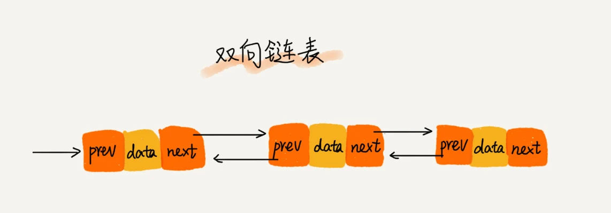
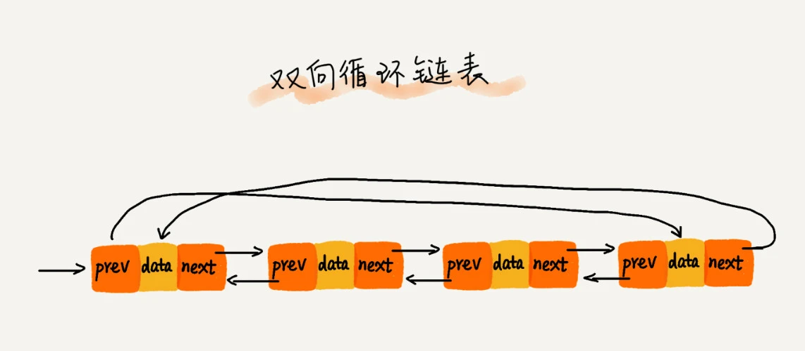

# 2.2 链表

## 链表的定义

::: tip
**链表（Linked list）** 通过“指针”将一组零散的内存块串联起来使用，它并不需要一块连续的内存空间。
:::

最常见的链表结构有：单链表、循环链表和双向链表。

### 1. 单链表


我们把内存块称为链表的 **“结点”**。为了将所有的结点串起来，每个链表的结点除了存储数据之外，还需要记录链上的下一个结点的地址。这个记录下个结点地址的指针叫作**后继指针**`next`。

第一个结点叫作**头结点**，把最后一个结点叫作**尾结点**。其中，头结点用来记录链表的基地址。有了它就可以遍历得到整条链表。而尾结点特殊的地方是：指针不是指向下一个结点，而是指向一个空地址 NULL，表示这是链表上最后一个结点。

先简单介绍一下链表结构的优缺点：

- **优点**：存储空间不必事先分配，在需要存储空间的时候可以临时申请，不会造成空间的浪费；链表最大的优点在于可以灵活的添加和删除元素，插入、移动、删除元素的时间效率远比数组高。

- **缺点**：不仅数据元素本身的数据信息要占用存储空间，指针也需要占用存储空间，链表结构比数组结构的空间开销大。

### 2. 循环链表


循环链表是一种特殊的单链表。它跟单链表唯一的区别就在尾结点。单链表的尾结点指针指向空地址，表示这就是最后的结点了。而循环链表的尾结点指针是指向链表的头结点。像一个环一样首尾相连，所以叫作“循环”链表。

和单链表相比，循环链表的优点是从链尾到链头比较方便。当要处理的数据具有环型结构特点时，就特别适合采用循环链表。比如著名的约瑟夫问题，尽管用单链表也可以实现，但是用循环链表实现的话，代码就会简洁很多。

### 3. 双向链表



单向链表只有一个方向，结点只有一个后继指针 `next` 指向后面的结点。而双向链表支持两个方向，每个结点不止有一个后继指针 `next` 指向后面的结点，还有一个前驱指针 `prev` 指向前面的结点。

双向链表需要额外的两个空间来存储后继结点和前驱结点的地址。所以存储同样多的数据，双向链表要比单链表占用更多的内存空间。虽然两个指针比较浪费存储空间，但可以支持双向遍历，支持 O(1)时间复杂度的情况下找到前驱结点，这也使双向链表在某些情况下的插入、删除等操作都要比单链表简单、高效。

除了插入、删除操作有优势之外，对于一个有序链表，双向链表的按值查询的效率也要比单链表高一些。因为可以记录上次查找的位置 p，每次查询时，根据要查找的值与 p 的大小关系，决定是往前还是往后查找，所以平均只需要查找一半的数据。

这就是**用空间换时间**的设计思想。当内存空间充足的时候，如果我们更加追求代码的执行速度，我们就可以选择空间复杂度相对较高、但时间复杂度相对很低的算法或者数据结构。相反，如果内存比较紧缺，比如代码跑在手机或者单片机上，这个时候，就要反过来用时间换空间的设计思路。

### 4. 双向循环链表

如果把循环链表和双向链表这两种链表整合在一起，就是一个新的版本：双向循环链表。



## 链表的操作

数据结构的操作一般涉及到增、删、改、查 4 种情况，链表的操作也基本上是这 4 种情况。

### 1. 插入结点

向链表中插入一个结点的效率很高，需要修改它前面的结点(前驱)，使其指向新加入的结点，而将新结点指向原来前驱结点指向的结点即可。


### 2. 删除结点

同样，从链表中删除一个结点，也很简单。只需将待删结点的前驱结点指向待删结点的，同时将待删结点指向 `null`，那么结点就删除成功了。


在进行数组的插入、删除操作时，为了保持内存数据的连续性，需要做大量的数据搬移，所以时间复杂度是 `O(n)`。

而在链表中插入或者删除一个数据，我们并不需要为了保持内存的连续性而搬移结点，因为链表的存储空间本身就不是连续的。所以，在链表中插入和删除一个数据是非常快速的，我们只需要考虑相邻结点的指针改变，所以对应的时间复杂度是 `O(1)`。

### 3. 查找结点

链表要想随机访问第 k 个元素，没有数组那么高效。

因为链表中的数据并非连续存储的，无法像数组那样，根据首地址和下标，通过寻址公式直接计算出对应的内存地址，而是需要根据指针一个结点一个结点地依次遍历，直到找到相应的结点。

所以，链表随机访问的性能没有数组好，需要 `O(n)` 的时间复杂度。

### 4. 修改结点

修改链表中某个结点的值，只需修改该结点的`data`值即可。

### 5. 增加结点

向链表尾部添加结点，需要判断以下链表是否为空，若是空链表，直接将链表的 `head` 指向新结点，否则需要遍历链表直至找到链表尾结点，再将尾结点的 `head` 指向新结点。

## 链表的实现

链表的实现包含两个类，一个是 **Node 类**，用来表示结点；另一个是 **LinkedList 类**，提供了对链表进行操作的方法。

`Node` 类包含两个属性： `element` 用来保存结点上的数据，`next` 用来保存指向下一个结点的链接。

具体实现如下：

```javascript
// 结点类
class Node {
  constructor(data) {
    this.data = data; // 当前结点的元素
    this.next = null; // 下一个结点链接
  }
}
```

`LinkedList` 类提供了对链表进行操作的方法，包括插入结点、删除结点、查找给定的值等。值得注意的是，它只有一个 属性，那就是使用一个 `Node` 对象来保存该链表的头结点。

它的构造函数的实现如下：

```javascript
// 链表类
class LinkedList {
  constructor() {
    this.head = null;
  }
  // 插入结点
  insert(data, target) {}
  // 查找结点
  find(data) {}
  // 删除结点
  remove(data) {}
  // 在链尾添加结点
  add(data) {}
  // 显示链表
  display() {}
}
```

`head` 结点的 `next` 属性初始化为 `null` ，当有新元素插入时，`next` 会指向新的元素。

### 实现一个单向链表

```javascript
class Node {
  constructor(data) {
    this.data = data;
    this.next = null;
  }
}

// 实现一个单项链表
class singleLinkedList {
  constructor() {
    this.head = null;
  }

  // 插入结点
  insert(data, target) {
    let node = new Node(data);
    let current = this.head;
    while (current.next) {
      if (current.data === target) {
        node.next = current.next;
        current.next = node;
        break;
      }
      current = current.next;
    }
  }
  // 查找结点
  find(data) {
    let current = this.head;
    while (current) {
      if (current.data === data) {
        return current;
      }
      current = current.next;
    }
    return null;
  }
  // 删除结点
  remove(data) {
    let current = this.head;
    let previous = null;
    while (current) {
      if (current.data === data) {
        if (previous === null) {
          this.head = current.next;
        } else {
          previous.next = current.next;
        }
        return true;
      }
      previous = current;
      current = current.next;
    }
    return false;
  }
  // 在链尾添加结点
  add(data) {
    let node = new Node(data);
    if (this.head === null) {
      this.head = node;
    } else {
      let current = this.head;
      while (current.next) {
        current = current.next;
      }
      current.next = node;
    }
  }
  // 显示链表
  display() {
    var current = this.head;
    console.log(current.data);
    while (current.next !== null) {
      console.log(current.next.data);
      current = current.next;
    }
  }
}
```

示例：

```javascript
const list = new singleLinkedList();
list.add(1);
list.add(2);
list.add(3);
list.insert(4, 2);
list.display();
console.dir(list, { depth: null });

// 打印结果：
1
2
4
3
singleLinkedList {
   head: Node {
      data: 1
      next: Node {
         data: 2
         next: Node {
            data: 4
            next: Node {
               data: 3
               next: null
            }
         }
      }
   }
}
```

### 链表 VS 数组

| 时间复杂度 |  链表  |  数组  |
| :--------: | :----: | :----: |
|    插入    | `O(n)` | `O(1)` |
|    删除    | `O(n)` | `O(1)` |
|  随机访问  | `O(1)` | `O(n)` |

数组和链表的性能对比，并不能局限于时间复杂度。在实际的软件开发中，不能仅仅利用复杂度分析就决定使用哪个数据结构来存储数据。

数组简单易用，在实现上使用的是连续的内存空间，可以借助 CPU 的缓存机制，预读数组中的数据，所以访问效率更高。而链表在内存中并不是连续存储，所以对 CPU 缓存不友好，没办法有效预读。


数组的缺点是大小固定，一经声明就要占用整块连续内存空间。如果声明的数组过大，系统可能没有足够的连续内存空间分配给它，导致“内存不足（out of memory）”。如果声明的数组过小，则可能出现不够用的情况。这时只能再申请一个更大的内存空间，把原数组拷贝进去，非常费时。链表本身没有大小的限制，天然地支持动态扩容，我觉得这也是它与数组最大的区别。

除此之外，因为链表中的每个结点都需要消耗额外的存储空间去存储一份指向下一个结点的指针，所以内存消耗会翻倍。而且，对链表进行频繁的插入、删除操作，还会导致频繁的内存申请和释放，容易造成内存碎片。如果代码对内存的使用非常苛刻，那数组就更合适。

## 链表的应用

- 单链表反转
- 链表中环的检测
- 两个有序的链表合并
- 删除链表倒数第 n 个结点
- 求链表的中间结点
- 链表区间逆序。第 92 题。
- 链表寻找中间节点。第 876 题。链表寻找倒数第 n 个节点。第 19 题。只需要一次遍历就可以得到答案。
- 合并 K 个有序链表。第 21 题，第 23 题。
- 链表归类。第 86 题，第 328 题。
- 链表排序，时间复杂度要求 O(n \* log n)，空间复杂度 O(1)。只有一种做法，归并排序，至顶向下归并。第 148 题。
- 判断链表是否存在环，如果有环，输出环的交叉点的下标；判断 2 个链表是否有交叉点，如果有交叉点，输出交叉点。第 141 题，第 142 题，第 160 题。

## 答题技巧

### 1. 理解指针或引用的含义；

### 2. 警惕指针丢失和内存泄漏；

- 插入结点时，一定要注意操作的顺序
- 删除链表结点时，也一定要记得手动释放内存空间。

### 3. 利用哨兵简化实现难度；

### 4. 重点留意边界条件处理；

### 5. 举例法和画图法，辅助思考；

### 6. 多写多练；

<!-- START TABLE -->
<!-- Please keep comment here to allow auto update -->
<!-- DON'T EDIT THIS SECTION, INSTEAD RE-RUN `npm run lc` TO UPDATE -->


## 相关题目

| 题号 | 标题 | 题解 | 标签 | 难度 |
| :------ | :------ | :------ | :------ | :------ |
| 0707 | [设计链表](https://leetcode.com/problems/design-linked-list/) |  | `设计` `链表` | <font color=#ffb800>Medium</font> |
| 0083 | [删除排序链表中的重复元素](https://leetcode.com/problems/remove-duplicates-from-sorted-list/) |  | `链表` | <font color=#15bd66>Esay</font> |
| 0082 | [删除排序链表中的重复元素 II](https://leetcode.com/problems/remove-duplicates-from-sorted-list-ii/) |  | `链表` `双指针` | <font color=#ffb800>Medium</font> |
| 0206 | [反转链表](https://leetcode.com/problems/reverse-linked-list/) | [JS](https://2xiao.github.io/leetcode-js/leetcode/problem/0206) | `递归` `链表` | <font color=#15bd66>Esay</font> |
| 0092 | [反转链表 II](https://leetcode.com/problems/reverse-linked-list-ii/) |  | `链表` | <font color=#ffb800>Medium</font> |
| 0025 | [K 个一组翻转链表](https://leetcode.com/problems/reverse-nodes-in-k-group/) |  | `递归` `链表` | <font color=#ff334b>Hard</font> |
| 0203 | [移除链表元素](https://leetcode.com/problems/remove-linked-list-elements/) |  | `递归` `链表` | <font color=#15bd66>Esay</font> |
| 0328 | [奇偶链表](https://leetcode.com/problems/odd-even-linked-list/) |  | `链表` | <font color=#ffb800>Medium</font> |
| 0234 | [回文链表](https://leetcode.com/problems/palindrome-linked-list/) |  | `栈` `递归` `链表` `1+` | <font color=#15bd66>Esay</font> |
| 0430 | [扁平化多级双向链表](https://leetcode.com/problems/flatten-a-multilevel-doubly-linked-list/) |  | `深度优先搜索` `链表` `双向链表` | <font color=#ffb800>Medium</font> |
| 0138 | [复制带随机指针的链表](https://leetcode.com/problems/copy-list-with-random-pointer/) |  | `哈希表` `链表` | <font color=#ffb800>Medium</font> |
| 0061 | [旋转链表](https://leetcode.com/problems/rotate-list/) |  | `链表` `双指针` | <font color=#ffb800>Medium</font> |

