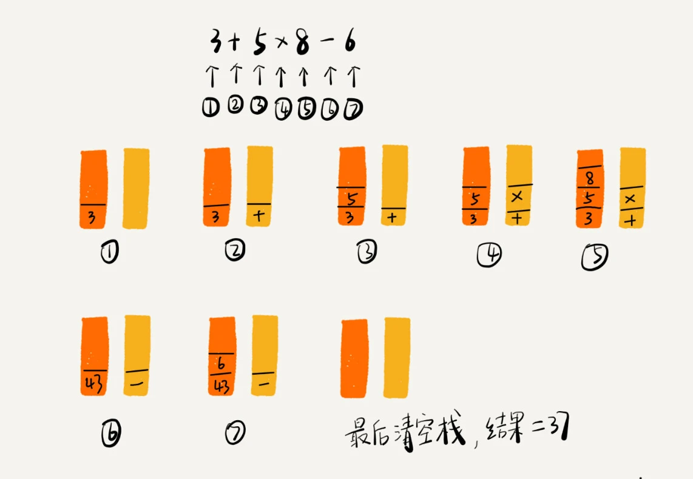

# 2.3 栈

## 栈的定义

::: tip
**栈（Stack）** 是一种“操作受限”的线性表，只允许在一端插入和删除数据。后进者先出，先进者后出，这就是典型的“栈”结构。
:::


栈是一种 「**后进先出（Last In First Out）**」 的线性表，简称为 「LIFO 结构」。

有一个非常贴切的例子，就是一摞叠在一起的盘子。我们平时放盘子的时候，都是从下往上一个一个放；取的时候，我们也是从上往下一个一个地依次取，不能从中间任意抽出。

我们可以从两个方面来解释一下栈的定义：

- 「**线性表**」

栈首先是一个线性表，栈中元素具有前驱后继的线性关系。栈中元素按照 a1,a2,...,an 的次序依次进栈。栈顶元素为 an。

- 「**后进先出原则**」

根据栈的定义，每次删除的总是栈中当前的栈顶元素，即最后进入栈的元素。而在进栈时，最先进入栈的元素一定在栈底，最后进入栈的元素一定在栈顶。也就是说，元素进入栈或者退出退栈是按照「后进先出（Last In First Out）」的原则进行的。

## 栈的实现

栈既可以用数组来实现，也可以用链表来实现。

用数组实现的栈，我们叫作**顺序栈**，用链表实现的栈，我们叫作**链式栈**。

从功能上来说，数组或链表可以完全替代栈，但特定的数据结构是对特定场景的抽象，数组或链表暴露了太多的操作接口，操作上的确灵活自由，但使用时就比较不可控，自然也就更容易出错。

当某个数据集合只涉及在一端插入和删除数据，并且满足后进先出、先进后出的特性，我们就应该首选“栈”这种数据结构。比如浏览器的前进后退功能。

## 栈的操作

栈主要包含两个操作，**入栈和出栈**，入栈（push）就是在栈顶插入一个数据；出栈（pop）就是从栈顶删除一个数据。

```javascript
// 基于数组实现的顺序栈
class ArrayStack {
  #arr = [];
  #size = 0;
  size() {
    return this.#size;
  }
  // 入栈
  push(item) {
    if (!item) {
      return false;
    }
    this.#arr.push(item);
    this.#size++;
    return true;
  }
  // 出栈
  pop() {
    var temp = this.#arr.pop();
    if (temp) {
      this.#size--;
    }
    return temp;
  }
  print() {
    console.log("---栈底---");
    for (var item of this.#arr) {
      console.log(item);
    }
    console.log("---栈顶---");
    console.log("栈的长度：", this.#size);
  }
}
```

示例：

```javascript
const stack = new ArrayStack()
stack.push(1)
stack.push(2)
stack.push(3)
stack.print()
stack.pop()
stack.print()

// 打印结果：
---栈底---
1
2
3
---栈顶---
栈的长度： 3

---栈底---
1
2
---栈顶---
栈的长度： 2
```

#### 空间复杂度：

不管是顺序栈还是链式栈，我们存储数据只需要一个大小为 n 的数组就够了。在入栈和出栈过程中，只需要一两个临时变量存储空间，所以空间复杂度是 O(1)。我们说空间复杂度的时候，是指除了原本的数据存储空间外，算法运行还需要额外的存储空间。

#### 时间复杂度：

不管是顺序栈还是链式栈，入栈、出栈只涉及栈顶个别数据的操作，所以时间复杂度都是 O(1)。

## 栈的应用

### 1. 表达式求值

一个常见的应用场景是，编译器利用栈来实现表达式求值。

::: tip
[227. 基本计算器 II - LeetCode](https://2xiao.github.io/leetcode-js/leetcode/problem/0227.html)
:::

#### # 题目大意

**描述**：给定一个字符串表达式 s，表达式中所有整数为非负整数，运算符只有 +、-、\*、/，没有括号。

**要求**：实现一个基本计算器来计算并返回它的值。

**说明**：

- 1≤s.length≤3∗10^5。
- s 由整数和算符（+、-、\*、/）组成，中间由一些空格隔开。
- s 表示一个有效表达式。
- 表达式中的所有整数都是非负整数，且在范围 [0,2^31−1]内。
- 题目数据保证答案是一个 32-bit 整数。

**示例**：
::: tip
输入：s = "3+2\*2"

输出：7
:::

::: tip
输入：s = " 3/2 "

输出：1
:::

#### # 解题思路

通过两个栈来实现。其中一个保存操作数的栈，另一个是保存运算符的栈。从左向右遍历表达式，当遇到数字，我们就直接压入操作数栈；当遇到运算符，就与运算符栈的栈顶元素进行比较。

如果比运算符栈顶元素的优先级高，就将当前运算符压入栈；如果比运算符栈顶元素的优先级低或者相同，从运算符栈中取栈顶运算符，从操作数栈的栈顶取 2 个操作数，然后进行计算，再把计算完的结果压入操作数栈，继续比较。

比如：`3 + 5 * 8 - 6`：



#### # 代码

```javascript

```

---

### 2. 括号匹配

还可以借助栈来检查表达式中的括号是否匹配。

::: tip
[20. 有效的括号 - LeetCode](https://2xiao.github.io/leetcode-js/leetcode/problem/0020.html)
:::

#### # 题目大意

**描述**：给定一个只包括 '('，')'，'{'，'}'，'['，']' 的字符串 s 。

**要求**：判断字符串 s 是否有效（即括号是否匹配）。

**说明**：
有效字符串需满足：

- 左括号必须用相同类型的右括号闭合。
- 左括号必须以正确的顺序闭合。

**示例**：
::: tip
输入：s = "()"

输出：True
:::

::: tip
输入：s = "()[]{}"

输出：True
:::

#### # 解题思路

用栈来保存未匹配的左括号，从左到右依次扫描字符串。当扫描到左括号时，则将其压入栈中；

当扫描到右括号时，从栈顶取出一个左括号。如果能够匹配，比如“`(`”跟“`)`”匹配，“`[`”跟“`]`”匹配，“`{`”跟“`}`”匹配，则继续扫描剩下的字符串。

如果扫描的过程中，遇到不能配对的右括号，或者栈中没有数据，则说明为非法格式。

当所有的括号都扫描完成之后，如果栈为空，则说明字符串为合法格式；否则，说明有未匹配的左括号，为非法格式。

#### # 代码

```javascript

```

---

### 3. 函数调用栈

还有一个比较经典的应用场景就是函数调用栈。

操作系统给每个线程分配了一块独立的内存空间，这块内存被组织成“栈”这种结构,用来存储函数调用时的临时变量。每进入一个函数，就会将临时变量作为一个栈帧入栈，当被调用函数执行完成，返回之后，将这个函数对应的栈帧出栈。更好地理解，来看下这段代码的执行过程。

```javascript
function main() {
    let a = 1;
    let ret = 0;
    let res = 0;
    ret = add(3, 5);
    res = a + ret;
    console.log("%d", res);
    reuturn 0;
}

function add(x, y) {
    let sum = 0;
    sum = x + y;
    return sum;
}
```

从代码中可以看出，main()函数调用了 add()函数，获取计算结果，并且与临时变量 a 相加，最后打印 res 的值。在执行到 add()函数时，函数调用栈的情况如下所示：


<!-- START TABLE -->
<!-- Please keep comment here to allow auto update -->
<!-- DON'T EDIT THIS SECTION, INSTEAD RE-RUN `npm run lc` TO UPDATE -->


## 相关题目

#### 栈基础题目

| 题号 | 标题 | 题解 | 标签 | 难度 |
| :------ | :------ | :------ | :------ | :------ |
| 1047 | [删除字符串中的所有相邻重复项](https://leetcode.com/problems/remove-all-adjacent-duplicates-in-string/) |  | 栈、字符串 | 简单 |
| 0155 | [最小栈](https://leetcode.com/problems/min-stack/) |  | 栈、设计 | 中等 |
| 0020 | [有效的括号](https://leetcode.com/problems/valid-parentheses/) | [JS](https://2xiao.github.io/leetcode-js/leetcode/problem/0020) | 栈、字符串 | 简单 |
| 0227 | [基本计算器 II](https://leetcode.com/problems/basic-calculator-ii/) | [JS](https://2xiao.github.io/leetcode-js/leetcode/problem/0227) | 栈、数学、字符串 | 中等 |
| 0739 | [每日温度](https://leetcode.com/problems/daily-temperatures/) |  | 栈、数组、单调栈 | 中等 |
| 0150 | [逆波兰表达式求值](https://leetcode.com/problems/evaluate-reverse-polish-notation/) |  | 栈、数组、数学 | 中等 |
| 0232 | [用栈实现队列](https://leetcode.com/problems/implement-queue-using-stacks/) |  | 栈、设计、队列 | 简单 |
| 剑指 Offer 09 | [用两个栈实现队列](https://leetcode.cn/problems/yong-liang-ge-zhan-shi-xian-dui-lie-lcof/) |  | 栈、设计、队列 | 简单 |
| 0394 | [字符串解码](https://leetcode.com/problems/decode-string/) |  | 栈、递归、字符串 | 中等 |
| 0032 | [最长有效括号](https://leetcode.com/problems/longest-valid-parentheses/) |  | 栈、字符串、动态规划 | 困难 |
| 0946 | [验证栈序列](https://leetcode.com/problems/validate-stack-sequences/) |  | 栈、数组、模拟 | 中等 |
| 剑指 Offer 06 | [从尾到头打印链表](https://leetcode.cn/problems/cong-wei-dao-tou-da-yin-lian-biao-lcof/) |  | 栈、递归、链表、双指针 | 简单 |
| 0071 | [简化路径](https://leetcode.com/problems/simplify-path/) |  | 栈、字符串 | 中等 |

#### 单调栈

| 题号 | 标题 | 题解 | 标签 | 难度 |
| :------ | :------ | :------ | :------ | :------ |
| 0739 | [每日温度](https://leetcode.com/problems/daily-temperatures/) |  | 栈、数组、单调栈 | 中等 |
| 0496 | [下一个更大元素 I](https://leetcode.com/problems/next-greater-element-i/) |  | 栈、数组、哈希表、单调栈 | 简单 |
| 0503 | [下一个更大元素 II](https://leetcode.com/problems/next-greater-element-ii/) |  | 栈、数组、单调栈 | 中等 |
| 0901 | [股票价格跨度](https://leetcode.com/problems/online-stock-span/) |  | 栈、设计、数据流、单调栈 | 中等 |
| 0084 | [柱状图中最大的矩形](https://leetcode.com/problems/largest-rectangle-in-histogram/) |  | 栈、数组、单调栈 | 困难 |
| 0316 | [去除重复字母](https://leetcode.com/problems/remove-duplicate-letters/) |  | 栈、贪心、字符串、单调栈 | 中等 |
| 0042 | [接雨水](https://leetcode.com/problems/trapping-rain-water/) |  | 栈、数组、双指针、动态规划、单调栈 | 困难 |
| 0085 | [最大矩形](https://leetcode.com/problems/maximal-rectangle/) |  | 栈、数组、动态规划、矩阵、单调栈 | 困难 |

