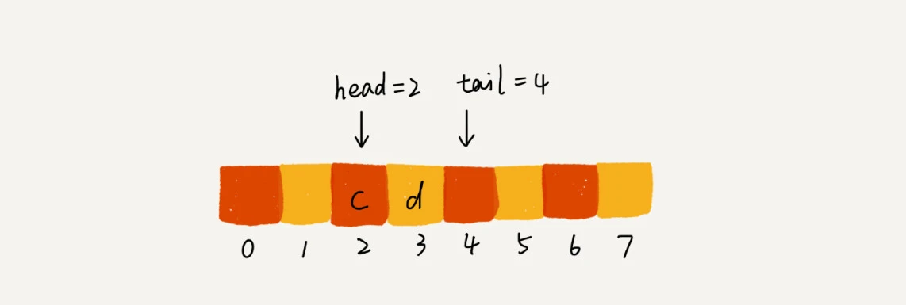

# 2.4 队列

## 队列的定义

::: tip

**队列（Queue）** ：一种线性表数据结构，是一种只允许在表的一端进行插入操作，而在表的另一端进行删除操作的线性表。

:::

先进者先出，这就是典型的“队列”。你可以把它想象成排队买票，先来的先买，后来的人只能站末尾，不允许插队。

队列跟栈一样，也是一种操作受限的线性表数据结构，栈只支持两个基本操作：**入栈** `push()` 和**出栈** `pop()`。队列最基本的操作也是两个：**入队** `enQueue()`，放一个数据到队列尾部；**出队** `deQueue()`，从队列头部取一个元素。


我们把队列中允许插入的一端称为 **队尾（rear）**；把允许删除的另一端称为 **队头（front）**。当表中没有任何数据元素时，称之为 **空队**。

我们可以从两个方面来解释一下队列的定义：

- 「**线性表**」

  队列首先是一个线性表，队列中元素具有前驱后继的线性关系。队列中元素按照 `a1,a2,...,an` 的次序依次入队。队头元素为 `a1`，队尾元素为 `an`。

- 「**先进先出原则**」

  元素进入队列或者退出队列是按照 **「先进先出（First In First Out）」** 的原则进行的，最先进入队列的元素在队头，最后进入队列的元素在队尾。每次从队列中删除的总是队头元素，即最先进入队列的元素。

## 队列的实现

跟栈一样，队列可以用数组来实现，也可以用链表来实现。

用数组实现的栈叫作**顺序栈**，用链表实现的栈叫作**链式栈**。

同样，用数组实现的队列叫作**顺序队列**，用链表实现的队列叫作**链式队列**。

### 顺序队列

```javascript
class ArrayQueue {
  constructor() {
    this._queue = [];
  }
  // 入队
  enQueue(data) {
    this._queue.push(data);
  }
  // 出队
  deQueue() {
    if (this.isEmpty()) {
      console.log("This queue is empty");
      return null;
    }
    return this._queue.shift();
  }
  // 判断是否为空队
  isEmpty() {
    return this._queue.length === 0;
  }
  // 查看队头元素
  front() {
    if (this.isEmpty()) {
      console.log("This queue is empty");
      return null;
    }
    return this._queue[0];
  }
  // 查看队尾元素
  rear() {
    if (this.isEmpty()) {
      console.log("This queue is empty");
      return null;
    }
    return this._queue[this.count() - 1];
  }
  // 清空队列
  clear() {
    delete this._queue;
    this._queue = [];
  }
  // 打印队列
  print() {
    console.log(this._queue);
  }
  // 获取队列中元素的数量
  count() {
    return this._queue.length;
  }
}
```

::: details 点击查看示例：

```javascript
const queue = new ArrayQueue();
queue.enQueue(1);
queue.enQueue(2);
queue.enQueue(3);
queue.print();
console.log("队头：", queue.front());
console.log("队尾：", queue.rear());
queue.deQueue();
queue.print();
console.log("队列中元素数量为：", queue.count());
queue.clear();
console.log("是否为空队：", queue.isEmpty());

// 打印结果：
// [1, 2, 3]
// 队头： 1
// 队尾： 3
// [2, 3]
// 队列中元素数量为：2
// 是否为空队： true
```

:::

---

### 链式队列

基于链表的实现，需要两个指针： `head` 指针和 `tail` 指针。它们分别指向链表的第一个结点和最后一个结点。

如图所示：

- 入队时：`tail.next= new_node, tail = tail.next`
- 出队时：`head = head.next`


```javascript
class Node {
  constructor(data) {
    this.data = data; // 节点中的数据
    this.next = null; // 下一个节点
  }
}
class LinkedListQueue {
  constructor() {
    this.head = null;
    this.tail = null;
    this.length = 0;
  }
  // 入队
  enQueue(node) {
    if (this.isEmpty()) {
      this.head = node;
      this.tail = node;
    } else {
      this.tail.next = node;
      this.tail = this.tail.next;
    }
    this.length++;
  }
  // 出队
  deQueue() {
    if (this.isEmpty()) return null;
    let cur = this.head;
    this.head = this.head.next;
    this.length--;
    return cur;
  }
  // 判断是否为空队
  isEmpty() {
    return this.length === 0;
  }
  // 查看队头元素
  front() {
    if (this.isEmpty()) {
      console.log("This queue is empty");
      return null;
    }
    return this.head.data;
  }
  // 查看队尾元素
  rear() {
    if (this.isEmpty()) {
      console.log("This queue is empty");
      return null;
    }
    return this.tail.data;
  }
  // 清空队列
  clear() {
    this.tail = null;
    this.head.next = null;
    this.head = null;
    this.length = 0;
  }
  // 打印队列
  print() {
    console.log(this.head);
  }
  // 获取队列中元素的数量
  count() {
    return this.length;
  }
}
```

::: details 点击查看示例：

```javascript
const queue = new LinkedListQueue();
queue.enQueue(new Node(1));
queue.enQueue(new Node(2));
queue.enQueue(new Node(3));
queue.deQueue();
queue.print();
console.log("队列中元素数量为：", queue.count());
console.log("队头：", queue.front());
console.log("队尾：", queue.rear());
console.log("是否为空队：", queue.isEmpty());

// 打印结果：
// Node {data: 2, next: Node {data: 3, next: null}}
// 队列中元素数量为：2
// 队头： 2
// 队尾： 3
// 是否为空队： false
```

:::

---

### 循环队列

::: tip
**循环队列（Circular Queue）** 是一种线性数据结构，其操作表现基于 FIFO（先进先出）原则，并且队尾被连接在队首之后，以形成一个循环。它也被称为“环形缓冲器”。
:::

在基于数组实现的顺序队列中，由于出队操作总是删除当前的队头元素，将 `front` 进行右移，而插入操作又总是在队尾进行。经过不断的出队、入队操作，队列的变化就像是使队列整体向右移动。

当队尾指针指向最右边时，即使在队列前面仍有空闲空间，也无法继续往队列中添加数据了，之前因为出队操作而产生空余位置没有利用上，这就造成了 **假溢出** 问题。



为了解决这个问题，我们可以将队列想象成为头尾相连的循环表。原本数组是有头有尾的，是一条直线。把首尾相连之后，被扳成了一个环，利用数学中的求模运算，我们能使用这些前面的空闲空间去存储新的值。


#### 相关题目

::: tip
[622. 设计循环队列 - LeetCode](https://2xiao.github.io/leetcode-js/leetcode/problem/0622.html)
:::

设计循环队列，支持如下操作：

- `MyCircularQueue(k)`: 构造器，设置队列长度为 `k` ；
- `Front`: 从队首获取元素。如果队列为空，返回 `-1` ；
- `Rear`: 获取队尾元素。如果队列为空，返回 `-1` ；
- `enQueue(value)`: 向循环队列插入一个元素。如果成功插入则返回真；
- `deQueue()`: 从循环队列中删除一个元素。如果成功删除则返回真；
- `isEmpty()`: 检查循环队列是否为空；
- `isFull()`: 检查循环队列是否已满；

**示例**：

```javascript
MyCircularQueue circularQueue = new MyCircularQueue(3); // 设置长度为 3
circularQueue.enQueue(1);  // 返回 true
circularQueue.enQueue(2);  // 返回 true
circularQueue.enQueue(3);  // 返回 true
circularQueue.enQueue(4);  // 返回 false，队列已满
circularQueue.Rear();  // 返回 3
circularQueue.isFull();  // 返回 true
circularQueue.deQueue();  // 返回 true
circularQueue.enQueue(4);  // 返回 true
circularQueue.Rear();  // 返回 4
```

**说明**：

- 所有的值都在 `0` 至 `1000` 的范围内；
- 操作数将在 `1` 至 `1000` 的范围内；
- 请不要使用内置的队列库。

```javascript

```

---

### 阻塞队列

---

### 并发队列

---

### 优先队列

## 队列的应用

<!-- START TABLE -->
<!-- Please keep comment here to allow auto update -->
<!-- DON'T EDIT THIS SECTION, INSTEAD RE-RUN `npm run lc` TO UPDATE -->

## 相关题目

---

#### 队列基础题目

| 题号 | 标题                                                                                   | 题解 | 标签                      | 难度                              |
| :--: | :------------------------------------------------------------------------------------- | :--: | :------------------------ | :-------------------------------- |
| 0622 | [设计循环队列](https://leetcode.com/problems/design-circular-queue/)                   |      | `设计` `队列` `数组` `1+` | <font color=#ffb800>Medium</font> |
| 0346 | [数据流中的移动平均值](https://leetcode.com/problems/moving-average-from-data-stream/) |      | `设计` `队列` `数组` `1+` | <font color=#15bd66>Esay</font>   |
| 0225 | [用队列实现栈](https://leetcode.com/problems/implement-stack-using-queues/)            |      | `栈` `设计` `队列`        | <font color=#15bd66>Esay</font>   |

---

#### 优先队列

| 题号 | 标题                                                                                                     |                              题解                               | 标签                                | 难度                              |
| :--: | :------------------------------------------------------------------------------------------------------- | :-------------------------------------------------------------: | :---------------------------------- | :-------------------------------- |
| 0703 | [数据流中的第 K 大元素](https://leetcode.com/problems/kth-largest-element-in-a-stream/)                  |                                                                 | `树` `设计` `二叉搜索树` `3+`       | <font color=#15bd66>Esay</font>   |
| 0347 | [前 K 个高频元素](https://leetcode.com/problems/top-k-frequent-elements/)                                |                                                                 | `数组` `哈希表` `分治` `5+`         | <font color=#ffb800>Medium</font> |
| 0451 | [根据字符出现频率排序](https://leetcode.com/problems/sort-characters-by-frequency/)                      |                                                                 | `哈希表` `字符串` `桶排序` `3+`     | <font color=#ffb800>Medium</font> |
| 0973 | [最接近原点的 K 个点](https://leetcode.com/problems/k-closest-points-to-origin/)                         |                                                                 | `几何` `数组` `数学` `4+`           | <font color=#ffb800>Medium</font> |
| 1296 | [划分数组为连续数字的集合](https://leetcode.com/problems/divide-array-in-sets-of-k-consecutive-numbers/) |                                                                 | `贪心` `数组` `哈希表` `1+`         | <font color=#ffb800>Medium</font> |
| 0239 | [滑动窗口最大值](https://leetcode.com/problems/sliding-window-maximum/)                                  |                                                                 | `队列` `数组` `滑动窗口` `2+`       | <font color=#ff334b>Hard</font>   |
| 0295 | [数据流的中位数](https://leetcode.com/problems/find-median-from-data-stream/)                            |                                                                 | `设计` `双指针` `数据流` `2+`       | <font color=#ff334b>Hard</font>   |
| 0023 | [合并 K 个升序链表](https://leetcode.com/problems/merge-k-sorted-lists/)                                 | [JS](https://2xiao.github.io/leetcode-js/leetcode/problem/0023) | `链表` `分治` `堆（优先队列）` `1+` | <font color=#ff334b>Hard</font>   |
| 0218 | [天际线问题](https://leetcode.com/problems/the-skyline-problem/)                                         |                                                                 | `树状数组` `线段树` `数组` `4+`     | <font color=#ff334b>Hard</font>   |
