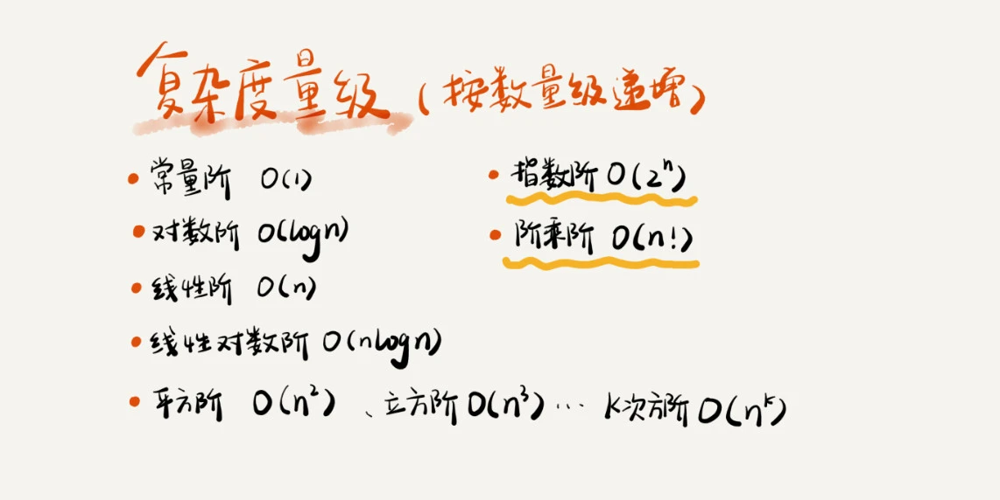

# 1.2 复杂度分析

想要学习数据结构与算法，首先要掌握一个最重要的概念——复杂度分析，它可以帮我们分析如何更省、更快地存储和处理数据。

## 时间复杂度

算法的 **时间复杂度（time complexity）** 是一个函数，它定性描述该算法的运行时间。用于评估执行程序所消耗的时间，可以估算出程序对处理器的使用程度。

时间复杂度常用大 O 符号表述，使用这种方式时，时间复杂度可被称为是渐近的，亦即考察输入值大小趋近无穷时的情况。

相同大小的不同输入值仍可能造成算法的执行时间不同，因此我们通常使用算法的最坏情况复杂度，记为 `T(n)` ，定义为任何大小的输入 n 所需的最大执行时间。

以下是一些最常用的 大 O 标记法 列表以及它们与不同大小输入数据的性能比较。

| 大 O 标记法    | 计算 10 个元素 | 计算 100 个元素 | 计算 1000 个元素 |
| -------------- | -------------- | --------------- | ---------------- |
| **O(1)**       | 1              | 1               | 1                |
| **O(log N)**   | 3              | 6               | 9                |
| **O(N)**       | 10             | 100             | 1000             |
| **O(N log N)** | 30             | 600             | 9000             |
| **O(N^2)**     | 100            | 10000           | 1000000          |
| **O(2^N)**     | 1024           | 1.26e+29        | 1.07e+301        |
| **O(N!)**      | 3628800        | 9.3e+157        | 4.02e+2567       |

### 数据结构操作的复杂性

| 数据结构       |  连接  |  查找  |  插入  |  删除  | 备注                                 |
| -------------- | :----: | :----: | :----: | :----: | ------------------------------------ |
| **数组**       |   1    |   n    |   n    |   n    |                                      |
| **栈**         |   n    |   n    |   1    |   1    |                                      |
| **队列**       |   n    |   n    |   1    |   1    |                                      |
| **链表**       |   n    |   n    |   1    |   1    |                                      |
| **哈希表**     |   -    |   n    |   n    |   n    | 在完全哈希函数情况下，复杂度是 O(1） |
| **二分查找树** |   n    |   n    |   n    |   n    | 在平衡树情况下，复杂度是 O(log(n))   |
| **B 树**       | log(n) | log(n) | log(n) | log(n) |                                      |
| **红黑树**     | log(n) | log(n) | log(n) | log(n) |                                      |
| **AVL 树**     | log(n) | log(n) | log(n) | log(n) |                                      |
| **布隆过滤器** |   -    |   1    |   1    |   -    | 存在一定概率的判断错误（误判成存在） |

### 数组排序算法的复杂性

<table style="width:100%">
    <tr>
        <th style="width:15%">排序算法</th><th style="width:15%">平均时间复杂度</th><th style="width:13%">最好情况</th><th style="width:15%">最坏情况</th><th style="width:12%">空间复杂度</th><th style="width:15%">排序方式</th><th style="width:15%">稳定性</th>
    </tr>
    <tr>
        <td>冒泡排序</td><td>O(n^2)</td><td>O(n)</td><td>O(n^2)</td><td>O(1)</td><td>in-place</td><td>稳定</td>
    </tr>
    <tr>
        <td>选择排序</td><td>O(n^2)</td><td>O(n^2)</td><td>O(n^2)</td><td>O(1)</td><td>in-place</td><td>不稳定</td>
    </tr>
    <tr>
        <td>插入排序</td><td>O(n^2)</td><td>O(n)</td><td>O(n^2)</td><td>O(1)</td><td>in-place</td><td>稳定</td>
    </tr>
    <tr>
        <td>希尔排序</td><td>O(nlogn)</td><td>O(nlog^2n)</td><td>O(nlog^2n)</td><td>O(1)</td><td>in-place</td><td>不稳定</td>
    </tr>
    <tr>
        <td>归并排序</td><td>O(nlogn)</td><td>O(nlogn)</td><td>O(nlogn)</td><td>O(n)</td><td>out-place</td><td>稳定</td>
    </tr>
    <tr>
        <td>快速排序</td><td>O(nlogn)</td><td>O(nlogn)</td><td>O(n^2)</td><td>O(logn)</td><td>in-place</td><td>不稳定</td>
    </tr>
    <tr>
        <td>堆排序</td><td>O(nlogn)</td><td>O(nlogn)</td><td>O(nlogn)</td><td>O(1)</td><td>in-place</td><td>不稳定</td>
    </tr>
    <tr>
        <td>桶排序</td><td>O(n+k)</td><td>O(n+k)</td><td>O(n^2)</td><td>O(n+k)</td><td>out-place</td><td>稳定</td>
    </tr>
    <tr>
        <td>计数排序</td><td>O(n+k)</td><td>O(n+k)</td><td>O(n+k)</td><td>O(k)</td><td>out-place</td><td>稳定</td>
    </tr>
    <tr>
        <td>基数排序</td><td>O(n*k)</td><td>O(n*k)</td><td>O(n*k)</td><td>O(n+k)</td><td>out-place</td><td>稳定</td>
    </tr>
    
</table>

### 分析复杂度的一些规则

- 多个时间复杂度相加，如果都是与 n 相关，则取取复杂度高的那一个，例如：`O(nlogn + n) = O(nlogn)，O(nlogn + n^2) = O(n^2)`。
- 多个时间复杂度相加，如果其中有些项的复杂度和 n 不相关则不能忽略任何项，例如：`O(AlogA + B)，O(AlogA + B^2)`
- 两个循环依次执行，则取复杂度高的那个，嵌套多个循环则需要累乘复杂度。

一个时间复杂度分析的例子：

> 有一个字符串数组，将数组中的每个字符串按照字母排序，然后在将整个字符串数组按照字典顺序排序。求整个操作的时间复杂度。
>
> - 我们来分析一下，假设最长字符串的长度是 s，数组中有 n 个字符串。
>
> - 对每个字符串排序 `O(slogs)`，将数组中的每个字符串按照字母排序`O(n * slogs)`；
>
> - 将整个字符串数组按字典排序 `O(s * nlogn)`；
>
> - 所以最后的时间复杂度是`O(n * slogs) + O(s * nlogn) = O(nslogs + nslogn) = O(ns * (logs+logn))`

### 时间复杂度优化

- 采用更好的算法：举例：`1+2+3...n` 从 `1～n` 求和，直接循环法，`for i->n: sum+=i` ，我们也可以用求和公式: `n(n+1)/2`；有些问题可以用二分查找等。
- 空间换时间，比如用 set 或 map 加快查找的速度，用二叉搜索树或者字典树加快字符串的搜索。

## 空间复杂度

**空间复杂度(Space Complexity)** 指的是算法在运行过程中所占存储空间的大小，依然使用大 O 来表示。用于评估执行程序所占用的内存空间，可以估算出程序对计算机内存的使用程度。

### 常见的空间复杂度

- 一维数组空间，如果存储了 n 个元素，空间复杂度`O(n)`；
- 二维数组空间，总共有 n 个数组，每个数组存储了 n 个元素，空间复杂度`O(n^2)`；
- 常数空间复杂度`O(1)`；

