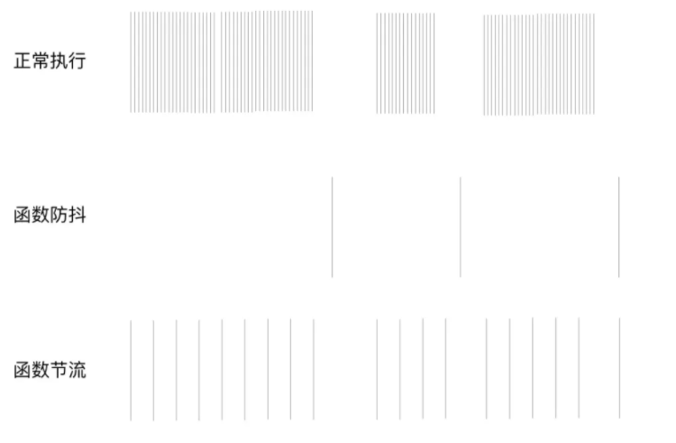

# 如何实现防抖和节流？

## 一、概述

防抖（Debounce）与节流（Throttle）是两种常见的性能优化手段，旨在限制高频率事件的执行次数，避免资源浪费，提高前端性能。

在浏览器中，诸如 `resize`、`scroll`、`keypress`、`mousemove` 等事件会频繁触发绑定的回调函数。如果不加限制，这些事件可能会显著增加资源消耗，导致页面卡顿。因此，通过防抖或节流机制，我们可以有效减少事件回调的执行频率。

- **节流（Throttle）**的核心思想是控制函数的执行频率。在指定的时间间隔内，无论事件触发多少次，函数最多执行一次。

- **防抖（Debounce）**的核心思想是延迟函数的执行。在事件不断触发的情况下，只有在事件触发停止后的一段时间内，函数才会被执行。

可以将电梯的运行比作函数的执行：

- **节流**：电梯每隔 15 秒运行一次，无论期间进出多少人，每 15 秒固定出发一次。
- **防抖**：电梯在乘客进入后等待 15 秒。如果在等待期间还有乘客进入，电梯重新计时，直到 15 秒内无人进入才出发。

## 二、节流的实现

### 时间戳实现

利用时间戳，记录上次函数执行的时间点。每次事件触发时，检查当前时间与上次执行时间的间隔是否大于指定时间，若满足条件则执行函数。  
这种方式在事件触发时会立即执行，但在停止触发后无法再执行。

```javascript
function throttleByTimestamp(fn, delay = 500) {
	let lastTime = Date.now();

	return function (...args) {
		const now = Date.now();
		if (now - lastTime >= delay) {
			fn.apply(this, args);
			lastTime = now;
		}
	};
}
```

### 定时器实现

通过定时器延迟函数执行。事件触发后，若定时器尚未结束，则不重新设定定时器；只有在当前定时器完成后，才允许设定新的定时器。  
这种方式在事件停止后仍会执行一次函数。

```javascript
function throttleByTimer(fn, delay = 500) {
	let timer = null;

	return function (...args) {
		if (!timer) {
			timer = setTimeout(() => {
				fn.apply(this, args);
				timer = null;
			}, delay);
		}
	};
}
```

### 综合实现

结合时间戳和定时器，确保函数在触发时立即执行，同时在停止触发后还能再次执行。

```javascript
function throttle(fn, delay = 500) {
	let lastTime = Date.now();
	let timer = null;

	return function (...args) {
		const now = Date.now();
		const remaining = delay - (now - lastTime);

		if (remaining <= 0) {
			clearTimeout(timer);
			timer = null;
			lastTime = now;
			fn.apply(this, args);
		} else if (!timer) {
			timer = setTimeout(() => {
				lastTime = Date.now();
				timer = null;
				fn.apply(this, args);
			}, remaining);
		}
	};
}
```

## 三、防抖的实现

### 基础实现

通过 `setTimeout` 延迟函数的执行，每次事件触发时重置计时器。在计时器到期之前，若有新的事件触发，则重新计时。

```javascript
function debounce(fn, delay = 500) {
	let timer = null;

	return function (...args) {
		clearTimeout(timer);
		timer = setTimeout(() => {
			fn.apply(this, args);
		}, delay);
	};
}
```

### 支持立即执行的实现

在部分场景下，需要函数在第一次触发事件时立即执行，随后进入防抖逻辑。可以通过一个标志变量 `immediate` 实现。

```javascript
function debounce(fn, delay = 500, immediate = false) {
	let timer = null;

	return function (...args) {
		const callNow = immediate && !timer;
		clearTimeout(timer);
		timer = setTimeout(() => {
			timer = null;
		}, delay);
		if (callNow) {
			fn.apply(this, args);
		}
	};
}
```

## 四、区别与对比

| **特性**     | **防抖（Debounce）**               | **节流（Throttle）**               |
| ------------ | ---------------------------------- | ---------------------------------- |
| **执行时机** | 事件停止触发后的指定时间内执行一次 | 指定时间间隔内执行一次             |
| **适用场景** | 连续事件中只需执行最后一次回调     | 需要限制高频事件的回调执行次数     |
| **实现机制** | 使用 `setTimeout` 延迟函数执行     | 使用时间戳或定时器控制函数执行频率 |

示例对比：

- 防抖：频繁触发的搜索框输入，只有在用户输入完成后才发起请求。
- 节流：滚动事件监听，每隔一定时间触发一次滚动加载逻辑。

下图展示了两者在时间轴上的执行效果：



## 五、应用场景

### 防抖适用场景

1. **搜索框输入**：用户停止输入时发起搜索请求。
2. **表单验证**：如手机号或邮箱验证，防止每次输入都触发检测。
3. **窗口调整事件**：`resize` 操作结束后重新计算窗口布局。

### 节流适用场景

1. **滚动加载**：例如滚动加载下一页内容或监听是否滚动到底部。
2. **输入框联想功能**：在输入过程中，定时获取联想结果。
3. **鼠标移动事件**：如元素拖拽，限制触发频率以减少性能消耗。
