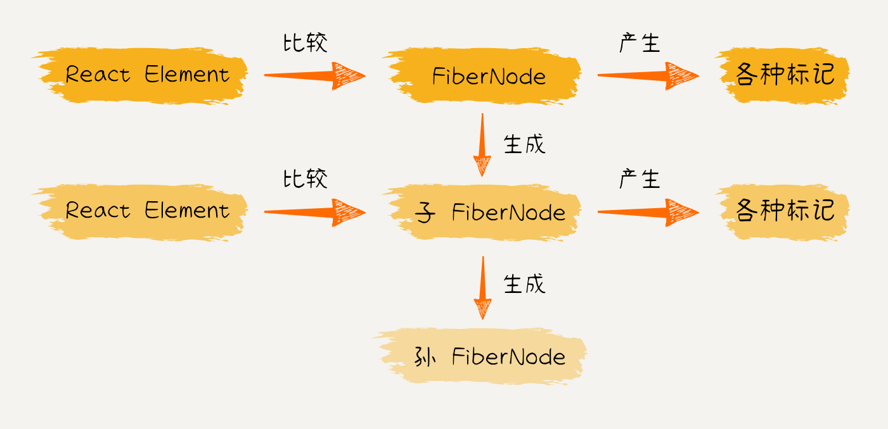

# 3. 实现 Reconciler

::: info 摘要

- Reconciler 简介
- 实现 FiberNode
- 实现 Reconciler 工作流程

相关代码可在 [`git tag v1.3`](https://github.com/2xiao/my-react/tree/v1.3) 查看

:::

## 1. Reconciler 简介


在前端框架出现之前，通常会使用 jQuery 这样的库来开发页面。jQuery 是一个过程驱动的库，开发者需要直接调用浏览器的宿主环境 API，例如 DOM 操作等。这意味着开发者需要手动管理页面状态和交互，通过执行一系列的操作来更新页面。

然而，随着前端框架的出现，工作方式发生了根本性的变化，从过程驱动转变为状态驱动。在状态驱动的模式下，开发者不再直接操作宿主环境 API，而是通过前端框架提供的运行时核心模块来管理页面状态和更新。这些核心模块，例如 React 中的 `Reconciler` 和 Vue 中的 `Renderer`，负责将开发者编写的代码翻译成对应的宿主环境 API 调用，以更新页面。

`Reconciler` 的中文名叫协调器，它负责处理 React 元素的更新并在内部构建虚拟 DOM，这个过程是 React 框架实现高效的 UI 渲染和更新的核心逻辑所在。以下是 `Reconciler` 主要做的事情：

1. **接收并解析 React 元素：** Reconciler 接收 JSX 或者 createElement 函数返回的 React 元素，并将其解析成虚拟 DOM 树的结构。
2. **协调更新：** 比较新旧虚拟 DOM 树的差异，确定哪些部分需要更新，并生成更新计划。
3. **构建虚拟 DOM 树：** 在组件更新时，根据生成的更新计划，Reconciler 会更新虚拟 DOM 树的结构以反映最新的组件状态。
4. **生成 DOM 更新指令：** 将更新后的虚拟 DOM 树转换为真实的 DOM 更新指令，描述了如何将变更应用到实际的 DOM 树上。

我们先在 `packages` 目录下新建一个 `react-reconciler` 文件夹，执行 `npm init`，并更改配置文件如下，执行 `pnpm i` 安装依赖。

```json
// packages/react-reconciler/package.json
{
	"name": "react-reconciler",
	"version": "1.0.0",
	"description": "react reconciler",
	"module": "index.ts",
	"dependencies": {
		"shared": "workspace: *"
	},
	"scripts": {
		"test": "echo \"Error: no test specified\" && exit 1"
	},
	"author": "",
	"license": "ISC"
}
```

## 2. 实现 FiberNode

`FiberNode`（纤维节点）是 `Reconciler` 的核心数据结构之一，用于构建协调树。`Reconciler` 使用 `FiberNode` 来表示 React 元素树中的节点，并通过比较 Fiber 树的差异，找出需要进行更新的部分，生成更新指令，来实现 UI 的渲染和更新。

每个 `FiberNode` 都表示着 React 元素树中的一个节点，它包含了以下几个重要的字段：

- **type**：节点的类型，可以是原生 DOM 元素、函数组件或类组件等；
- **props**：节点的属性，包括 DOM 元素的属性、函数组件的 props 等；
- **stateNode**：节点对应的实际 DOM 节点或组件实例；
- **child**：指向节点的第一个子节点；
- **sibling**：指向节点的下一个兄弟节点；
- **return**：指向节点的父节点；
- **alternate**：指向节点的备份节点，用于在协调过程中进行比较；
- **effectTag**：表示节点的副作用类型，如更新、插入、删除等；
- **pendingProps**：表示节点的新属性，用于在协调过程中进行更新。

接下来我们来实现一下 `FiberNode` 这个数据结构。

在 `packages/react-reconciler/src/` 目录下新建 `fiber.ts` 文件，用来实现 `FiberNode` 类；新建 `workTags.ts` 文件，用于标识不同类型的工作单元；新建 `fiberFlags.ts` 文件，用于标识不同类型的副作用；代码如下：

::: code-tabs

@tab fiber.ts

```typescript
// packages/react-reconciler/src/fiber.ts
import { Props, Key, Ref } from 'shared/ReactTypes';
import { WorkTag } from './workTags';
import { NoFlags, Flags } from './fiberFlags';

export class FiberNode {
	tag: WorkTag;
	key: Key;
	stateNode: any;
	type: any;
	return: FiberNode | null;
	sibling: FiberNode | null;
	child: FiberNode | null;
	index: number;
	ref: Ref;
	pendingProps: Props;
	memorizedPros: Props | null;
	memorizedState: any;
	alternate: FiberNode | null;
	flags: Flags;
	subtreeFlags: Flags;
	updateQueue: unknown;

	constructor(tag: WorkTag, pendingProps: Props, key: Key) {
		// 类型
		this.tag = tag;
		this.key = key;
		this.ref = null;
		this.stateNode = null; // 节点对应的实际 DOM 节点或组件实例
		this.type = null; // 节点的类型，可以是原生 DOM 元素、函数组件或类组件等

		// 构成树状结构
		this.return = null; // 指向节点的父节点
		this.sibling = null; // 指向节点的下一个兄弟节点
		this.child = null; // 指向节点的第一个子节点
		this.index = 0; // 索引

		// 作为工作单元
		this.pendingProps = pendingProps; // 表示节点的新属性，用于在协调过程中进行更新
		this.memorizedPros = null; // 已经更新完的属性
		this.memorizedState = null; // 更新完成后新的 State

		this.alternate = null; // 指向节点的备份节点，用于在协调过程中进行比较
		this.flags = NoFlags; // 表示节点的副作用类型，如更新、插入、删除等
		this.subtreeFlags = NoFlags; // 表示子节点的副作用类型，如更新、插入、删除等
		this.updateQueue = null; // 更新计划队列
	}
}
```

@tab workTags.ts

```typescript
// packages/react-reconciler/src/workTags.ts
export type WorkTag =
	| typeof FunctionComponent
	| typeof HostRoot
	| typeof HostComponent
	| typeof HostText;

export const FunctionComponent = 0;
export const HostRoot = 3;
export const HostComponent = 5;
export const HostText = 6;
```

@tab fiberFlags.ts

```typescript
// packages/react-reconciler/src/fiberFlags.ts
export type Flags = number;

export const NoFlags = 0b0000000;
export const HasEffect = 0b0000001;
export const Placement = 0b0000010;
export const Update = 0b0000100;
export const ChildDeletion = 0b0001000;
```

:::

## 3. 实现 Reconciler 工作流程



`Reconciler` 的工作流程总的来说就是对 Fiber 树进行一次 **深度优先遍历（DFS）** ，首先访问根节点，然后依次访问左子树和右子树，通过比较新节点（新生成的 `React Element`）和旧节点（现有的 `FiberNode`），生成更新计划，并打上不同的标记。

1. **遍历 Fiber 树：**
   React 使用深度优先搜索（DFS）算法来遍历 Fiber 树，首先会从 Fiber 树的根节点开始进行遍历，遍历整个组件树的结构。

2. **比较新旧节点：**
   对于每个 Fiber 节点，`Reconciler` 会比较新节点（即新的 `React Element`）和旧节点（即现有的 `FiberNode`）之间的差异，比较的内容包括节点类型、属性、子节点等方面的差异。

3. **生成更新计划：**
   根据比较的结果，`Reconciler` 会生成一个更新计划，用于确定需要进行的操作，更新计划通常包括哪些节点需要更新、哪些节点需要插入到 DOM 中、哪些节点需要删除等信息。

4. **打标记（Tagging）：**
   为了记录不同节点的操作，React 会为每个节点打上不同的标记。例如，如果节点需要更新，可能会打上更新标记（Update Tag）；如果节点是新创建的，可能会打上插入标记（Placement Tag）；如果节点被移除，可能会打上删除标记（Deletion Tag）等。

5. **更新 Fiber 节点：**
   根据生成的更新计划和标记，`Reconciler` 会更新对应的 Fiber 节点以反映组件的最新状态。更新操作可能包括更新节点的状态、更新节点的属性、调用生命周期方法等。

6. **递归处理子节点：**
   对于每个节点的子节点，React 会递归地重复进行上述的比较和更新操作，以确保整个组件树都得到了正确的处理。

当所有 React Element 都比较完成之后，会生成一棵新的 Fiber 树，此时，一共存在两棵 Fiber 树：

- **current**: 与视图中真实 UI 对应的 Fiber 树，当 React 开始新的一轮渲染时，会使用 `current` 作为参考来比较新的树与旧树的差异，决定如何更新 UI；
- **workInProgress**: 触发更新后，正在 Reconciler 中计算的 Fiber 树，一旦 `workInProgress` 上的更新完成，它将会被提交为新的`current`，成为下一次渲染的参考树，并清空旧的 `current` 树。

下面我们来实现一下 `Reconciler` 的完整工作流程。

在 `packages/react-reconciler/src/` 目录下新建 `workLoop.ts` 文件：

```typescript
// packages/react-reconciler/src/workLoop.ts
import { FiberNode } from './fiber';

let workInProgress: FiberNode | null = null;

function renderRoot(root: FiberNode) {
	prepareFreshStack(root);
	do {
		try {
			workLoop();
			break;
		} catch (e) {
			console.warn('workLoop发生错误：', e);
			workInProgress = null;
		}
	} while (true);
}

// 初始化 workInProgress 变量
function prepareFreshStack(root: FiberNode) {
	workInProgress = root;
}

// 深度优先遍历，向下递归子节点
function workLoop() {
	while (workInProgress !== null) {
		performUnitOfWork(workInProgress);
	}
}

function performUnitOfWork(fiber: FiberNode) {
	// 比较并返回子 FiberNode
	const next = beginWork(fiber);
	fiber.memorizedPros = fiber.pendingProps;

	if (next == null) {
		// 没有子节点，则遍历兄弟节点或父节点
		completeUnitOfWork(fiber);
	} else {
		// 有子节点，继续向下深度遍历
		workInProgress = next;
	}
}

// 深度优先遍历，向下递归子节点
function completeUnitOfWork(fiber: FiberNode) {
	let node: FiberNode | null = fiber;
	do {
		// 生成更新计划
		completeWork(node);
		// 有兄弟节点，则遍历兄弟节点
		const sibling = node.sibling;
		if (sibling !== null) {
			workInProgress = sibling;
			return;
		}
		// 否则向上返回，遍历父节点
		node = node.return;
		// workInProgress 最终指向根节点
		workInProgress = node;
	} while (node !== null);
}
```

---

至此，我们就完成了 `Reconciler` 的大致工作流程，下一节将深入实现 `Reconciler` 的更新机制。

相关代码可在 `git tag v1.3` 查看，地址：[https://github.com/2xiao/my-react/tree/v1.3](https://github.com/2xiao/my-react/tree/v1.3)
