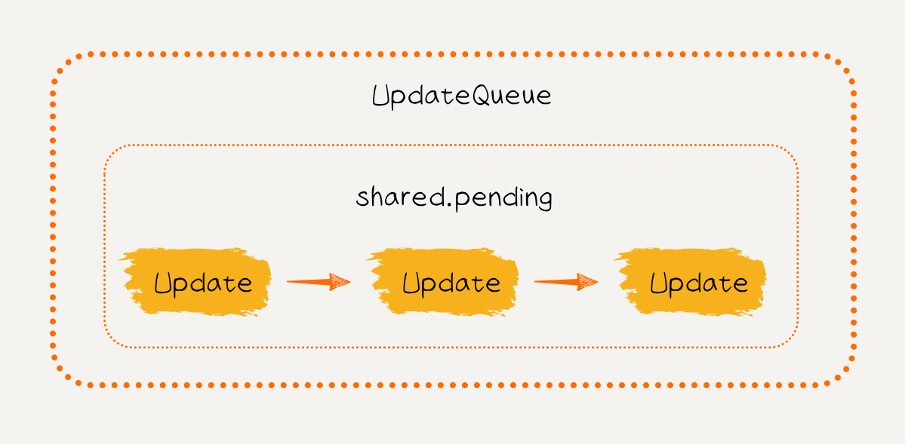
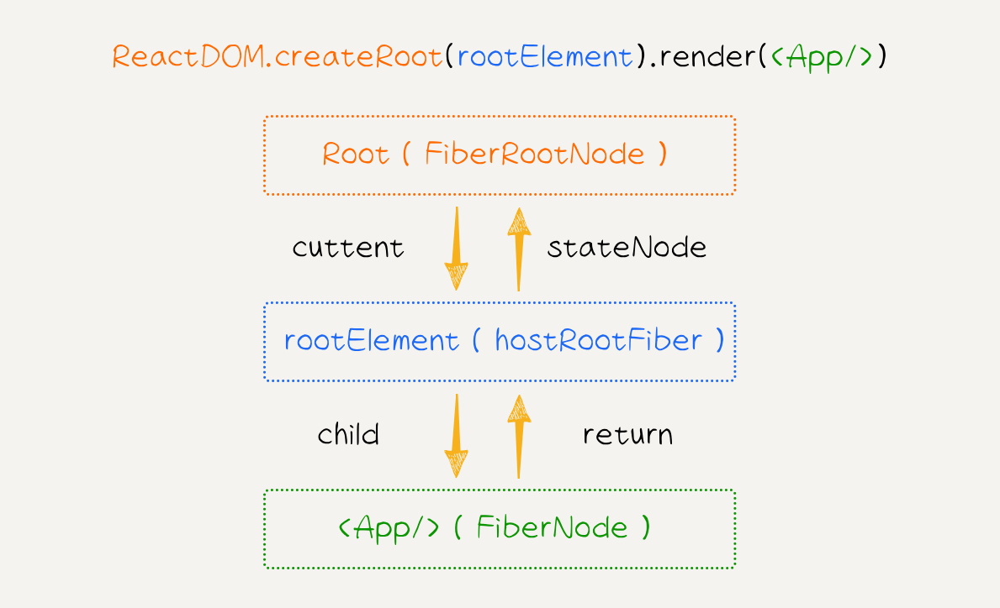

# 4. 实现更新机制

::: info 摘要

- React 更新流程
- 实现 UpdateQueue
- 实现触发更新

相关代码可在 [`git tag v1.4`](https://github.com/2xiao/my-react/tree/v1.4) 查看

:::

## 1. React 更新流程

React 中的更新流程大致可以分为以下几个阶段：

1. **触发更新（Update Trigger）：** 更新可以由组件的状态变化、属性变化、父组件的重新渲染、用户事件等触发，如：

   - 创建 React 应用的根对象 `ReactDOM.creatRoot().render()`；
   - 类组件 `this.setState()`；
   - 函数组件 `useState useEffect`；

2. **调度阶段（Schedule Phase）：** 调度器根据更新任务的优先级，将更新任务添加到相应的更新队列中，这个阶段决定了何时以及以何种优先级执行更新任务。

3. **协调阶段（Reconciliation Phase）：** 协调阶段 `Reconciler` 负责构建 Fiber 树，处理新旧虚拟 DOM 树之间的差异，生成更新计划，确定需要进行的操作。

4. **提交阶段（Commit Phase）：** 提交阶段将更新同步到实际的 DOM 中，React 执行 DOM 操作，例如创建、更新或删除 DOM 元素，反映组件树的最新状态。

## 2. 实现 UpdateQueue

为了实现上述更新流程，首先需要定义两个数据结构：`Update` 和 `UpdateQueue`，它们一起组成了 React 中管理组件状态更新的机制。



#### Update（更新）

- `Update` 表示对组件状态的一次更新操作。
- 当组件状态发生变化时（例如由 `setState` 触发），React 会创建一个 `Update` 对象，其中包含了新的状态或者状态的更新部分。
- `Update` 对象描述了如何修改组件的状态，如添加新的状态、更新现有的状态、删除状态等，以及与此更新相关的一些元数据，如优先级等。
- Update 对象记录了组件状态的变化，但实际的状态更新并不会立即执行，而是会被添加到更新队列中等待处理。

#### UpdateQueue（更新队列）

- `UpdateQueue` 是一个队列数据结构，用于存储组件的更新操作。
- 当组件的状态发生变化时，会生成一个新的 `Update` 对象，并将其添加到组件的 `UpdateQueue` 中。
- `UpdateQueue` 管理着组件的状态更新顺序，确保更新操作能够按照正确的顺序和优先级被应用到组件上。
- 更新队列通常是以链表的形式实现的，每个 Update 对象都链接到下一个更新对象，形成一个更新链表。在 React 的更新过程中，会遍历更新队列，并根据其中的更新操作来更新组件的状态以及更新 DOM。

在 `packages/react-reconciler/src/` 目录下新建 `updateQueue.ts` 文件：

::: code-tabs

@tab updateQueue.ts

```typescript
// packages/react-reconciler/src/updateQueue.ts
import { Action } from 'shared/ReactTypes';
import { Update } from './fiberFlags';

// 定义 Update 数据结构
export interface Update<State> {
	action: Action<State>;
}

// 定义 UpdateQueue 数据结构
export interface UpdateQueue<State> {
	shared: {
		pending: Update<State> | null;
	};
}

// 创建 Update 实例的方法
export const createUpdate = <State>(action: Action<State>): Update<State> => {
	return {
		action
	};
};

// 创建 UpdateQueue 实例的方法
export const createUpdateQueue = <State>(): UpdateQueue<State> => {
	return {
		shared: {
			pending: null
		}
	};
};

// 将 Update 添加到 UpdateQueue 中的方法
export const enqueueUpdate = <State>(
	updateQueue: UpdateQueue<State>,
	update: Update<State>
) => {
	updateQueue.shared.pending = update;
};

// 从 UpdateQueue 中消费 Update 的方法
export const processUpdateQueue = <State>(
	baseState: State,
	pendingUpdate: Update<State> | null
): { memorizedState: State } => {
	const result: ReturnType<typeof processUpdateQueue<State>> = {
		memorizedState: baseState
	};
	if (pendingUpdate !== null) {
		const action = pendingUpdate.action;
		if (action instanceof Function) {
			// 若 action 是回调函数：(baseState = 1, update = (i) => 5i)) => memorizedState = 5
			result.memorizedState = action(baseState);
		} else {
			// 若 action 是状态值：(baseState = 1, update = 2) => memorizedState = 2
			result.memorizedState = action;
		}
	}
	return result;
};
```

@tab ReactTypes.ts

```typescript
// packages/shared/ReactTypes.ts
// ...

// 定义 Action type
export type Action<State> = State | ((prevState: State) => State);
```

:::

## 3. 实现触发更新

上面我们提到，更新 React 应用可以由多种触发方式引发，包括组件的状态变化、属性变化、父组件的重新渲染以及用户事件等。

先来处理创建 React 应用的根对象这种情况，也就是 `ReactDOM.createRoot(rootElement).render(<App/>)` 这条语句：

- `ReactDOM.createRoot()` 函数生成一个新的 `Root` 对象，它在源码中是 `FiberRootNode` 类型，充当了 React 应用的根节点。
- `rootElement` 则是要渲染到的 DOM 节点，它在源码中是 `hostRootFiber` 类型，作为 React 应用的根 DOM 节点。
- `render()` 方法将组件 `<App/>` 渲染到根节点上。在这个过程中，React 会创建一个代表 `<App/>` 组件的 `FiberNode`，并将其添加到 `Root` 对象的 Fiber 树上。



根据上图，我们先来实现 `FiberRootNode` 类型：

```typescript
// packages/react-reconciler/src/fiber.ts
export class FiberRootNode {
	container: Container;
	current: FiberNode;
	finishedWork: FiberNode | null;
	constructor(container: Container, hostRootFiber: FiberNode) {
		this.container = container;
		this.current = hostRootFiber;
		// 将根节点的 stateNode 属性指向 FiberRootNode，用于表示整个 React 应用的根节点
		hostRootFiber.stateNode = this;
		// 指向更新完成之后的 hostRootFiber
		this.finishedWork = null;
	}
}
```

接着我们来实现 `ReactDOM.createRoot().render()` 过程中调用的 API:

- **createContainer 函数:** 用于创建一个新的容器（container），该容器包含了 React 应用的根节点以及与之相关的一些配置信息。`createContainer` 函数会创建一个新的 `Root` 对象，该对象用于管理整个 React 应用的状态和更新。

- **updateContainer 函数:** 用于更新已经存在的容器中的内容。在内部，`updateContainer` 函数会调用 `scheduleUpdateOnFiber` 等方法，通过 Fiber 架构中的协调更新过程，将新的 React 元素（`element`）渲染到容器中，并更新整个应用的状态。

新建文件 `fiberReconciler.ts`，里面有 `createContainer` 和 `updateContainer` 两个函数，在 `workLoop.ts` 文件中实现 `scheduleUpdateOnFiber`函数：

::: code-tabs

@tab fiberReconciler.ts

```typescript
// packages/react-reconciler/src/fiberReconciler.ts
import { Container } from 'hostConfig';
import { FiberNode, FiberRootNode } from './fiber';
import { HostRoot } from './workTags';
import {
	UpdateQueue,
	createUpdate,
	createUpdateQueue,
	enqueueUpdate
} from './updateQueue';
import { ReactElementType } from 'shared/ReactTypes';
import { scheduleUpdateOnFiber } from './workLoop';

export function createContainer(container: Container) {
	const hostRootFiber = new FiberNode(HostRoot, {}, null);
	const root = new FiberRootNode(container, hostRootFiber);
	hostRootFiber.updateQueue = createUpdateQueue();
	return root;
}

export function updateContainer(
	element: ReactElementType | null,
	root: FiberRootNode
) {
	const hostRootFiber = root.current;
	const update = createUpdate<ReactElementType | null>(element);
	enqueueUpdate(
		hostRootFiber.updateQueue as UpdateQueue<ReactElementType | null>,
		update
	);
	scheduleUpdateOnFiber(hostRootFiber);
	return element;
}
```

@tab workLoop.ts

```typescript
// packages/react-reconciler/src/workLoop.ts
// ...

// 调度功能
export function scheduleUpdateOnFiber(fiber: FiberNode) {
	const root = markUpdateFromFiberToRoot(fiber);
	renderRoot(root);
}

// 从触发更新的节点向上遍历到 FiberRootNode
function markUpdateFromFiberToRoot(fiber: FiberNode) {
	let node = fiber;
	while (node.return !== null) {
		node = node.return;
	}
	if (node.tag == HostRoot) {
		return node.stateNode;
	}
	return null;
}
```

:::

另外，在上一节中，我们在实现 `prepareFreshStack` 函数时，直接将 `root` 作为参数赋值给了 `workInProgress`，但现在我们知道了，`root` 其实是 `FiberRootNode` 类型的，不能直接赋值给 `FiberNode` 类型的 `workInProgress`，所以需要写一个 `createWorkInProgress` 函数处理一下：

::: code-tabs
@tab workLoop.ts

```typescript
// packages/react-reconciler/src/workLoop.ts
function renderRoot(root: FiberRootNode) {
	prepareFreshStack(root);
	do {
		try {
			workLoop();
			break;
		} catch (e) {
			console.warn('workLoop发生错误：', e);
			workInProgress = null;
		}
	} while (true);
}

// 初始化 workInProgress 变量
function prepareFreshStack(root: FiberRootNode) {
	workInProgress = createWorkInProgress(root.current, {});
}

// ...
```

@tab fiber.ts

```typescript
// packages/react-reconciler/src/fiber.ts
// ...

// 根据 FiberRootNode.current 创建 workInProgress
export const createWorkInProgress = (
	current: FiberNode,
	pendingProps: Props
): FiberNode => {
	let workInProgress = current.alternate;
	if (workInProgress == null) {
		// 首屏渲染时（mount）
		workInProgress = new FiberNode(current.tag, pendingProps, current.key);
		workInProgress.stateNode = current.stateNode;

		// 双缓冲机制
		workInProgress.alternate = current;
		current.alternate = workInProgress;
	} else {
		// 非首屏渲染时（update）
		workInProgress.pendingProps = pendingProps;
		// 将 effect 链表重置为空，以便在更新过程中记录新的副作用
		workInProgress.flags = NoFlags;
		workInProgress.subtreeFlags = NoFlags;
	}
	// 复制当前节点的大部分属性
	workInProgress.type = current.type;
	workInProgress.updateQueue = current.updateQueue;
	workInProgress.child = current.child;
	workInProgress.memoizedProps = current.memoizedProps;
	workInProgress.memorizedState = current.memorizedState;

	return workInProgress;
};
```

:::

---

至此，我们已经实现了 React 应用在首次渲染或后续更新时的大致更新流程，一起来回顾一下：

- 首先，我们通过 `createContainer` 函数创建了 React 应用的根节点 `FiberRootNode`，并将其与 DOM 节点（`hostFiberRoot`）连接起来；

- 然后，通过 `updateContainer` 函数创建了一个更新（`update`），并将其加入到更新队列（`updateQueue`）中，启动了首屏渲染或后续更新的机制；

- 接着会调用 `scheduleUpdateOnFiber` 函数开始调度更新，从触发更新的节点开始向上遍历，直到达到根节点 `FiberRootNode`；

- 接着会调用 `renderRoot` 函数，初始化 `workInProgress` 变量，生成与 `hostRootFiber` 对应的 `workInProgress hostRootFiber`；

- 接着就开始 `Reconciler` 的更新流程，即 `workLoop` 函数，对 Fiber 树进行深度优先遍历（DFS）；

- 在向下遍历阶段会调用 `beginWork` 方法，在向上返回阶段会调用 `completeWork` 方法，这两个方法负责 Fiber 节点的创建、更新和处理，具体实现会在下一节会讲到。

相关代码可在 `git tag v1.4` 查看，地址：[https://github.com/2xiao/my-react/tree/v1.4](https://github.com/2xiao/my-react/tree/v1.4)
