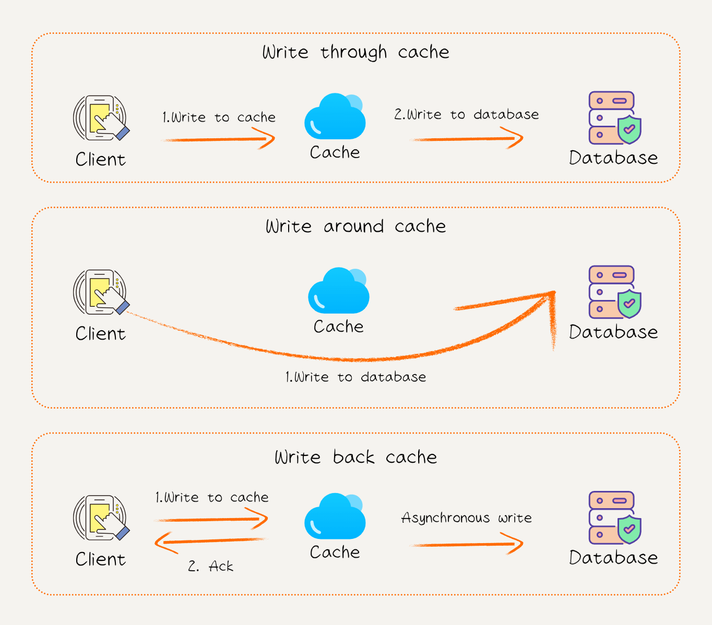

# 11. 缓存

## 缓存的基本概念

### 什么是缓存？

缓存是一种临时存储机制，旨在保存经常使用的数据以便快速访问。缓存可以部署在多个层级，包括客户端（如浏览器缓存）、应用服务器（如内存缓存）和数据库附近（如 Redis、Memcached）。通过缓存，可以在快速存储和访问频繁请求的数据的同时，减轻对底层服务的压力。

---

### 为什么需要缓存？

- **提升性能：** 减少冗余计算和频繁的数据访问，提升响应速度。
- **降低负载：** 减轻数据库和后端服务的压力，节省计算资源。
- **减少延迟：** 缓存通过在本地或更近的存储访问数据，显著缩短响应时间。

---

### 核心指标

- **缓存命中率（Cache Hit Ratio）：** 表示缓存满足请求的比例，命中率高代表缓存利用率高。
- **缓存一致性：** 确保缓存和底层数据源的一致性。
- **过期时间（TTL, Time-to-Live）：** 数据在缓存中的存活时间，避免长时间保存过时数据。

## 缓存的类型与模式

### 按位置分类

- **客户端缓存：** 直接存储在用户设备（如浏览器本地存储、Cookie、Service Worker），适用于静态资源（如图片、CSS、JS 文件）的缓存。
- **边缘缓存（CDN）：** 部署在离用户较近的网络节点上，用于分发内容（如视频、静态文件）。
- **服务端缓存：** 存储在后端服务器或专用的缓存服务中，如 Redis、Memcached，用于动态数据的缓存。

---

### 按存储内容分类

- **键值对缓存：** 使用键值对存储数据，高效查询。
  - 示例：Redis、Memcached。
- **对象缓存：** 保存更复杂的结构化数据。
  - 示例：缓存数据库查询结果。
- **结果缓存：** 缓存特定计算的结果以避免重复执行。
  - 示例：推荐算法的排序结果。

## 缓存的策略

### 写入策略

1. **写直达（Write-through）：**

   - 每次写入操作同时更新缓存和底层存储。
   - **优点：** 缓存和数据源一致性好。
   - **缺点：** 增加了写操作的延迟。

2. **写旁路（Write-around）：**

   - 仅将写操作更新到底层存储，而不更新缓存。
   - **优点：** 避免缓存污染。
   - **缺点：** 如果写后立即读，可能导致缓存未命中。

3. **写回（Write-back）：**

   - 写入先更新缓存，稍后批量同步到底层存储。
   - **优点：** 提高了写操作效率。
   - **缺点：** 存在数据丢失风险（如缓存宕机）。

---

### 淘汰策略

- **LRU（Least Recently Used）：**
  - 移除最近最少使用的缓存条目，Redis 默认使用 LRU。
  - 详见：[LeetCode 146. LRU 缓存](https://wangfuyou.com/leetcode-js/problem/0146)
- **LFU（Least Frequently Used）：**
  - 移除使用频率最低的缓存条目。
  - 详见：[LeetCode 460. LFU 缓存](https://wangfuyou.com/leetcode-js/problem/0460)
- **FIFO（First In First Out）：**
  - 移除最早加入的缓存条目。
  - 详见：[LeetCode 622. 设计循环队列](https://wangfuyou.com/leetcode-js/problem/0622)
- **TTL（Time-to-Live）：**
  - 设置缓存的存活时间，到期后自动移除。

## 缓存的一致性问题

缓存一致性指缓存数据与底层存储之间的同步问题。常见挑战包括：

### 一致性模型

- **强一致性：** 缓存始终与底层数据保持一致，但开销较高。
- **最终一致性：** 允许短暂的不一致，最终达到一致性。

---

### 解决方案

1. **失效通知：** 数据更新时通知缓存失效。
2. **主动刷新：** 定期刷新缓存，确保数据最新。
3. **双写同步：** 同时写入缓存和底层存储。

## 缓存的最佳实践

### 适用场景

- **读多写少：** 缓存更适合读多写少的场景，如商品详情页面。
- **数据稳定：** 适用于短期内不频繁变化的数据。

---

### 配置优化

- **合理设置 TTL：** 根据业务需求调整缓存过期时间，避免频繁失效或长时间保存陈旧数据。
- **数据分区：** 对缓存进行分区管理，以隔离不同模块或用户数据。

---

### 监控与调整

- **监控命中率：** 及时发现低效的缓存策略。
- **调整缓存大小：** 根据系统负载和内存容量动态调整。

## 缓存的典型应用

1. **Web 应用：**
   - 使用 Redis 缓存用户会话和热点数据，提升性能。
2. **分布式系统：**
   - 使用分布式缓存（如 Redis Cluster）应对高并发场景。
3. **CDN 服务：**
   - 缓存静态资源，如图片和视频，加速内容分发。
