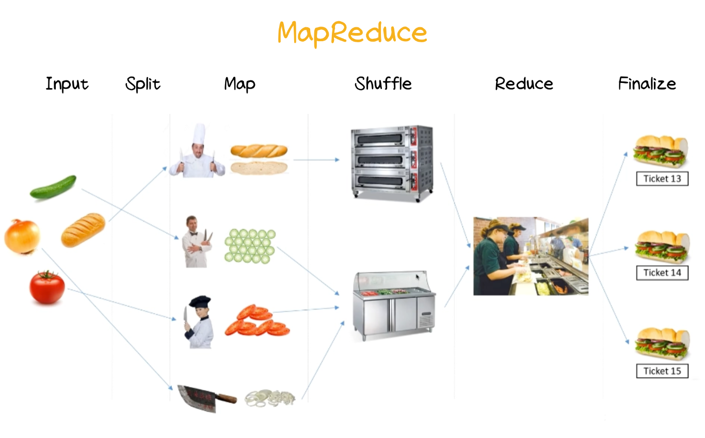
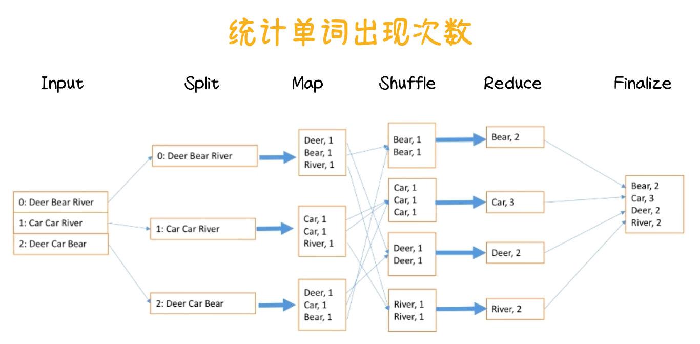

# 21. Map Reduce

## 什么是 MapReduce？

**MapReduce** 是一种编程模型和处理框架，专门设计用于处理大规模数据集。由 Google 在 2004 年提出并在论文中详细阐述，MapReduce 通过简单的 Map 和 Reduce 两个阶段，允许开发者用简单的代码处理分布式计算任务，同时由框架处理数据的分割、分发和容错。

其核心思想是将数据分割为小块，分布式地进行计算，最终合并结果。MapReduce 的设计目标是使开发者无需担心并行化、分布式计算细节和硬件故障，从而专注于计算逻辑。

## MapReduce 的六个步骤

1. **Input（输入）**  
   数据集被分割成多个小数据块，存储在分布式文件系统（如 HDFS）中。

2. **Split（分割）**  
   数据分为独立的输入片段，每个片段分配给一个 Map Task 进行处理。

3. **Map（映射）**  
   每个 Map Task 读取一个数据片段并执行用户定义的 Map 函数，将原始数据转换为**键值对（key-value pairs）**形式。例如，在单词计数任务中，Map 阶段会将文本分割成类似 `(word, 1)` 的键值对。

4. **Shuffle（分组）**  
   中间结果按键分类和分组，将相同键的所有键值对发送到同一个 Reduce Task。

5. **Reduce（归约）**  
   每个 Reduce Task 执行用户定义的 Reduce 函数，将同一键的所有值归约为最终结果。例如，将 `(word, [1, 1, 1])` 转换为 `(word, count)`。

6. **Finalize（最终输出）**  
   Reduce Task 的输出写入分布式文件系统或数据库中，供后续使用。

## 示例：单词计数（Word Count）

假设我们需要统计一批文本文件中每个单词的出现次数，MapReduce 的工作流程如下：

- **Input 阶段**：输入数据 `"Dear Bear River", "Car Car River", "Dear Car Bear"`
- **Split 阶段**：将数据分为独立的输入片段，每个片段分配给一个 Map Task
- **Map 阶段**：将文本分割成键值对，如 Map Task 0 输出键值对：`(Dear, 1), (Bear, 1), (River, 1)`。
- **Shuffle 阶段**：将键值对按键分组，将相同键的所有键值对发送到同一个 Reduce Task：`(Bear, [1, 1])`, `(Car, [1, 1, 1])`, `(Dear, [1, 1])`, `(River, [1, 1])`。
- **Reduce 阶段**：每个 Reduce Task 执行 Reduce 函数,将同一键的所有值累加：`(Bear, 2)`, `(Car, 3)`, `(Dear, 2)`, `(River, 2)`。
- **Finalize 阶段**：将 Reduce Task 的输出结果写入数据库。

## 应用场景

MapReduce 擅长解决需要处理**大规模、分布式数据**的任务，特别是在以下场景中表现出色：

1. **日志分析**：分析和处理分布式系统生成的大量日志文件。
2. **文本处理**：如倒排索引生成、文本搜索、自然语言处理等。
3. **数据转换**：从原始格式转换为结构化格式。
4. **机器学习**：如聚类、统计计算、训练模型等。
5. **图计算**：如 PageRank 算法。

## MapReduce 的优势

1. **简化分布式计算**  
   开发者只需关注 Map 和 Reduce 函数的逻辑，复杂的并行化和容错由框架负责。

2. **高扩展性**  
   可扩展到数千台机器处理 PB 级数据。

3. **容错能力**  
   自动处理任务失败，通过重新调度未完成的任务保证计算的可靠性。

4. **成本效益**  
   使用普通硬件的分布式集群即可处理海量数据。

5. **通用性**  
   适用于各种数据处理任务，包括结构化和非结构化数据。

## MapReduce 的局限性

1. **延迟较高**：  
   对于实时处理任务（如流式处理），MapReduce 的批处理模式不够高效。

2. **开发复杂性**：  
   尽管简化了并行化，但复杂任务仍需处理许多中间数据格式和步骤。

3. **迭代效率低**：  
   在需要多次迭代（如机器学习）的场景中，每次迭代都需重新读写文件，效率较低。

## 总结

MapReduce 是一种简洁但强大的编程模型，通过分而治之的方法，使得处理海量数据变得简单可扩展。尽管随着 Spark 等新框架的兴起，其使用率有所下降，但在一些批处理场景中仍然有着广泛的应用价值。
