# 6. 设计键值存储

键值存储（Key-Value Store）是一种非关系型数据库，具有以下特点：

- 每个唯一标识符作为一个键（Key）存储，并与一个值（Value）关联。
- 键必须唯一，可以是明文字符串或哈希值。
- 从性能角度看，较短的键通常表现更优。

示例键：

- 明文键：`"last_logged_in_at"`
- 哈希键：`253DDEC4`

我们将设计一个支持以下操作的键值存储系统：

- `put(key, value)`：插入与 `key` 相关联的 `value`。
- `get(key)`：获取与 `key` 相关联的 `value`。

## 理解问题并确定设计范围

在设计系统时，需权衡读写性能与内存使用之间的关系。此外，数据一致性与系统可用性之间也存在取舍。

设计目标包括：

- **小型键值对**：键值对的大小约为 10KB。
- **大规模数据存储**：系统应能存储海量数据。
- **高可用性**：系统即使在发生故障时也能快速响应。
- **高可扩展性**：系统需支持扩展以处理大数据集。
- **自动扩展**：根据流量自动添加或删除服务器。
- **可调一致性**。
- **低延迟**。

## 单机键值存储

单机键值存储实现简单。  
只需维护一个内存中的哈希表，用来存储键值对。然而，内存可能成为瓶颈，因为无法容纳全部数据。

扩展方式：

- 数据压缩
- 仅将频繁使用的数据存储在内存中，其余存储在磁盘上

即便如此，单台服务器的容量很快会达到上限。

## 分布式键值存储

分布式键值存储通过分布式哈希表（Distributed Hash Table）将键分配到多个节点上。设计时需要考虑 CAP 定理。

### CAP 定理

CAP 定理指出，分布式系统无法同时满足以下三种属性：

- **一致性（Consistency）**：所有客户端在任何时间点都能看到相同的数据。
- **可用性（Availability）**：所有客户端都能收到响应，即使某些节点发生故障。
- **分区容错性（Partition Tolerance）**：系统在部分节点间无法通信的情况下仍可正常工作。

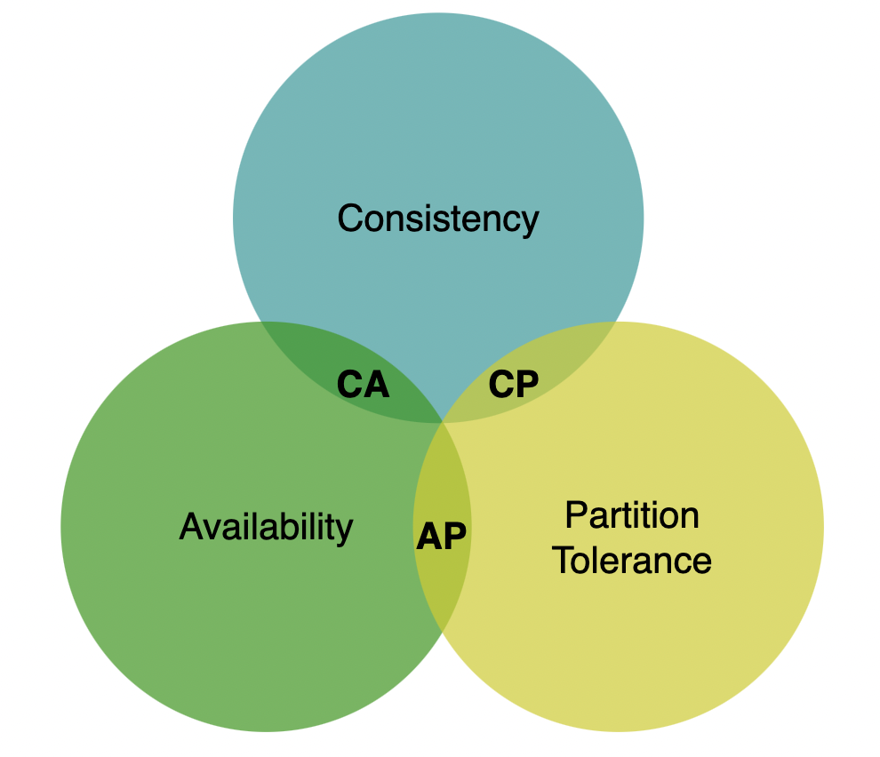

在现实世界中，由于网络故障不可避免，支持一致性和可用性的分布式系统无法真正存在。

理想情况中的分布式数据存储示例：

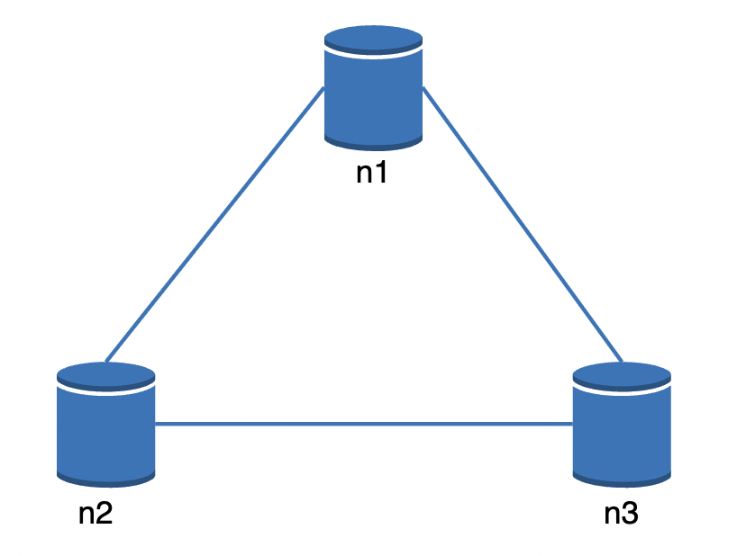

在现实中，网络分区可能阻止节点间通信，例如节点 3：

**一致性优先**：如果优先保证一致性，则上述情况下所有写操作会被阻塞。  
**可用性优先**：如果优先保证可用性，系统会继续接受读写请求，但可能返回过时数据。在节点 3 恢复后，会重新同步数据。

具体选择需要根据需求与面试官讨论。

## 系统组件

以下是构建分布式键值存储的核心组件。

### 数据分区

对于足够大的数据集，无法在单台服务器上维护，因此需要将数据分成多个分区并分布到多个节点上。

挑战在于：

1. 如何均匀分布数据？
2. 在集群调整规模时，如何最小化数据迁移？

通过一致性哈希（上一章讨论过）可以解决这些问题：

- 将服务器映射到哈希环上。
- 对键进行哈希，并映射到顺时针方向最近的服务器。

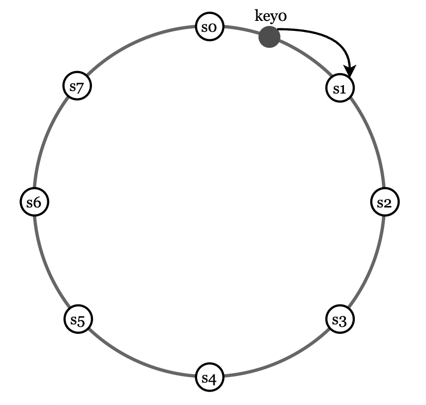

优点：

- **自动扩展**：可随意添加/删除服务器，且对键位置的影响最小。
- **异构性**：容量更高的服务器可以分配更多虚拟节点。

### 数据复制

为实现高可用性和可靠性，需将数据复制到多个节点上。

可通过将键分配到哈希环上的多个节点实现：

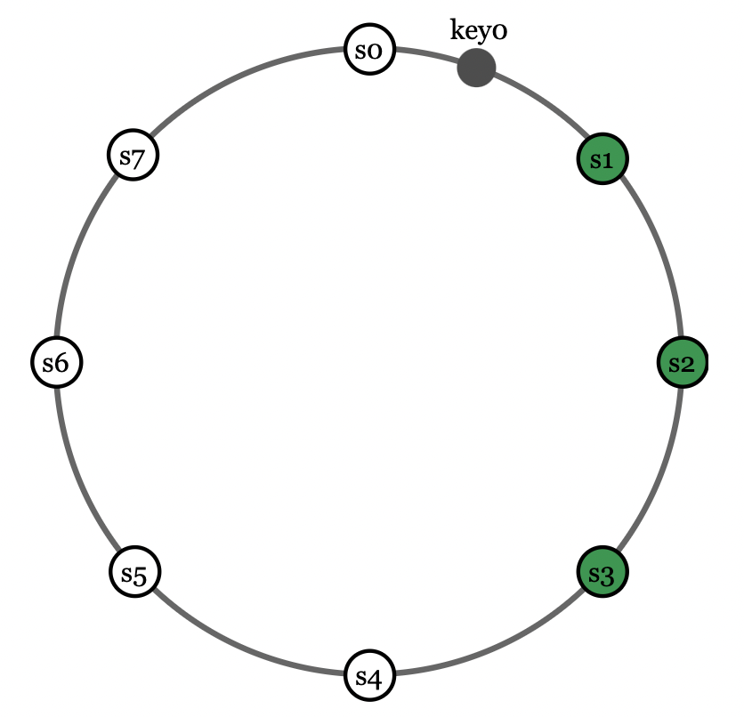

注意：复制时需避免所有副本分配到同一物理节点上。  
为此，可选择不同的物理节点。为进一步提高可靠性，可将数据复制到不同数据中心中，防止单个数据中心的故障。

### 一致性

数据复制后，需要保持同步。  
可以使用 **Quorum 共识** 来保证一致性：

- `N`：副本数量
- `W`：写操作需确认的副本数量
- `R`：读操作需确认的副本数量

  

`W` 和 `R` 的配置需权衡延迟与一致性：

- `W = 1, R = 1`：低延迟，最终一致性
- `W + R > N`：强一致性，高延迟

其他配置：

- `R = 1, W = N`：强一致性，快速读，写操作较慢。
- `R = N, W = 1`：强一致性，快速写，读操作较慢。

#### 一致性模型

常见一致性模型：

- **强一致性**：始终返回最新数据。
- **弱一致性**：可能返回旧数据。
- **最终一致性**：可能返回旧数据，但最终所有键都会达到最新状态。

例如：Cassandra 和 DynamoDB 采用最终一致性。它允许并发写入，客户端负责解决数据冲突。

### 数据冲突解决：版本控制

复制提高了可用性，但可能引发数据不一致。例如：

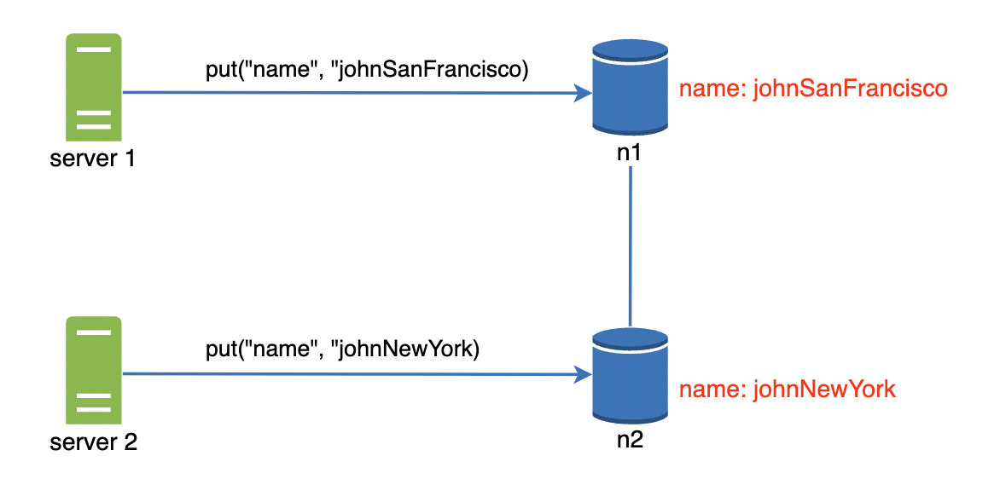

可使用向量时钟（Vector Clock）解决冲突。  
向量时钟是 [服务器, 版本] 对，记录数据版本变化：

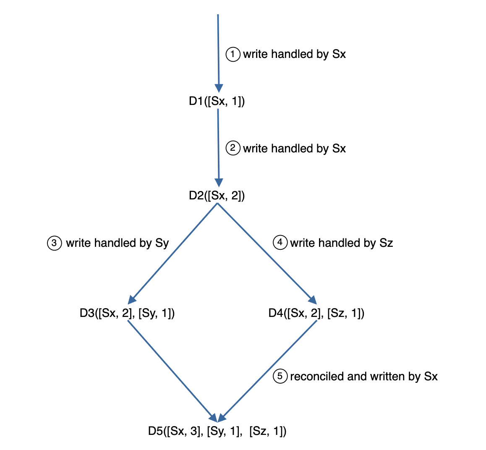

通过检测版本是否是祖先关系（版本戳是否小于另一版本）判断冲突：

- `[s0, 1][s1, 1]` 是 `[s0, 1][s1, 2]` 的祖先 -> 无冲突。
- `[s0, 1]` 不是 `[s1, 1]` 的祖先 -> 需解决冲突。

权衡点：

- 增加客户端复杂性。
- 向量时钟可能迅速膨胀，增加内存开销。

### 故障处理

大规模分布式系统中，故障不可避免。需设计可靠的错误检测与恢复策略。

#### 故障检测

判断服务器是否宕机不能仅基于网络中断。  
一种方法是全量多播（All-to-All Multicasting），但在节点多时效率低：

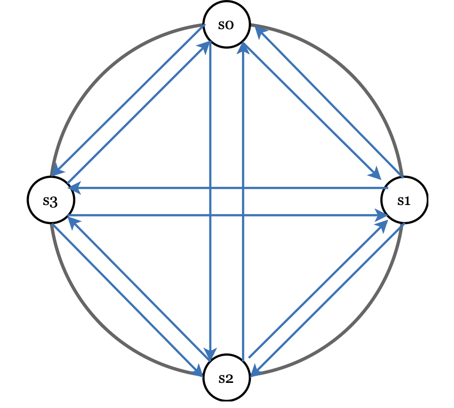

更好的方式是使用 **Gossip 协议**：

- 每个节点维护成员列表及心跳计数。
- 周期性随机向其他节点发送心跳，节点间传播心跳。
- 未收到心跳时，将成员标记为离线。

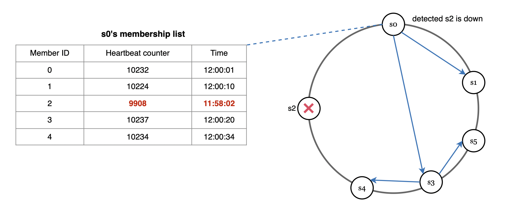

#### 临时故障

通过 **Hinted Handoff** 提高可用性：  
如果某节点暂时离线，可将其数据暂时交由健康节点处理，恢复后再回传。

#### 永久故障

若副本永久不可用，可通过 **Merkle 树** 进行反熵协议（Anti-Entropy）同步数据：

Merkle 树将数据分块，每块生成哈希，仅对不同块进行比较以减少传输数据量。

#### 数据中心故障

自然灾害或硬件问题可能导致数据中心宕机。  
为增强韧性，需将数据复制到多个数据中心中。

## 系统架构图

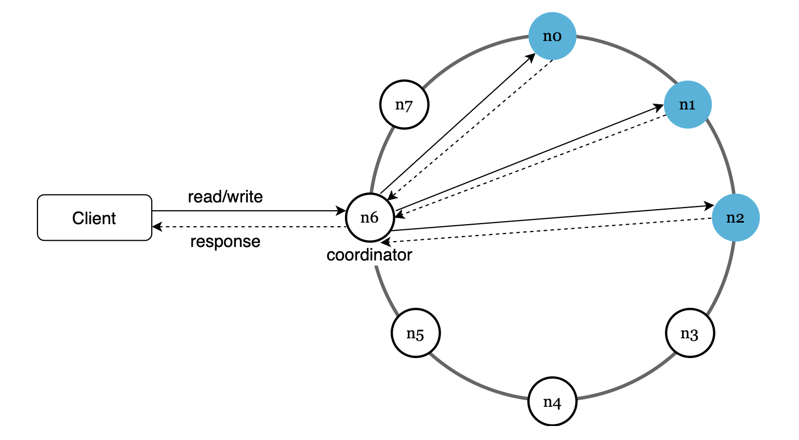

主要特性：

- 客户端通过简单的 API 与键值存储系统进行通信。
- 协调器作为客户端与键值存储之间的代理。
- 使用一致性哈希将节点分布在哈希环上。
- 系统为去中心化设计，支持自动化的节点添加和删除。
- 数据在多个节点上复制以确保可靠性。
- 系统无单点故障。

每个节点需负责的部分任务：

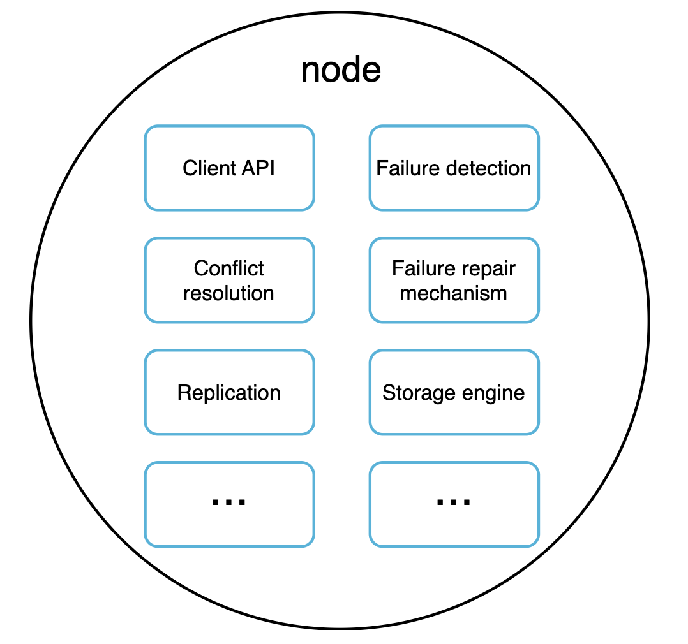

### 写入路径

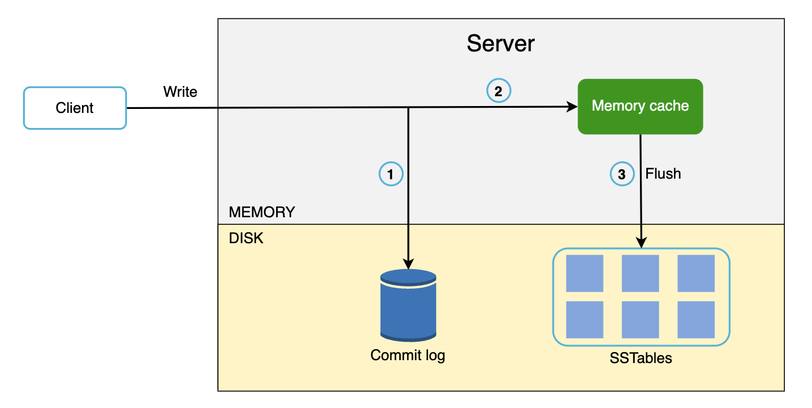

- 写请求会被持久化到提交日志（Commit Log）中。
- 数据被写入内存缓存。
- 当内存缓存满或达到设定阈值时，数据会刷新到磁盘上的 SSTable。

SSTable（排序字符串表）：保存的是排序好的键值对。

### 读取路径

当数据存在于内存中时的读取路径：

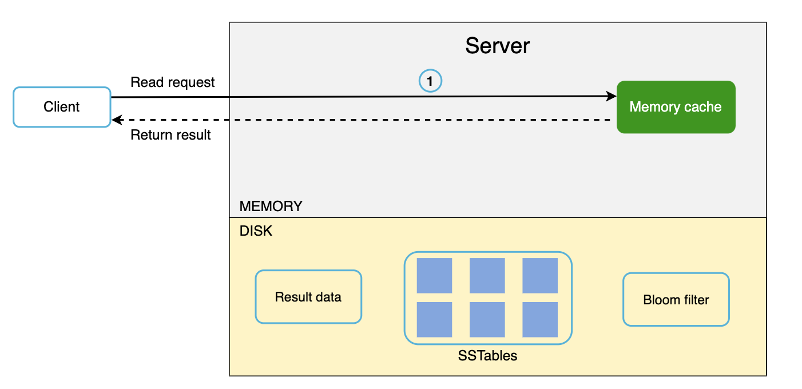

当数据不在内存中时的读取路径：

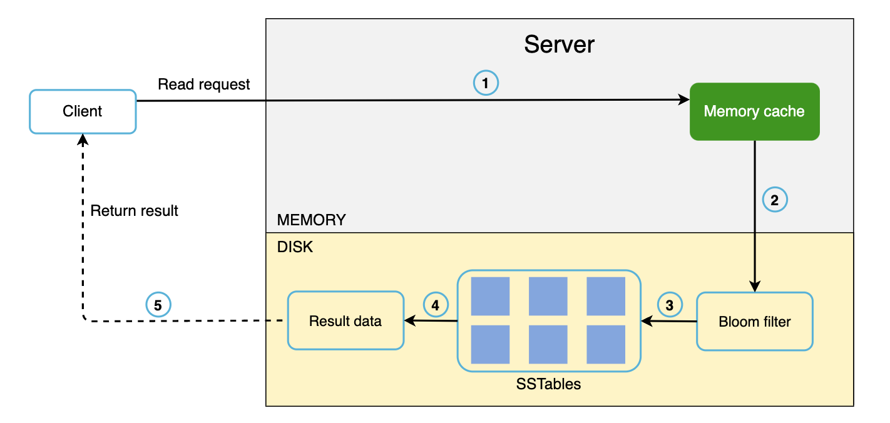

- 如果数据在内存中，则直接从内存中获取。否则，去 SSTable 中查找。
- 使用布隆过滤器（Bloom Filter）来高效定位 SSTable 中的数据。
- SSTable 返回结果数据后，最终将其返回给客户端。

## 总结

本文涵盖了多个概念和技术，总结如下：

<!-- prettier-ignore -->
| **目标/问题** | **技术** |
| ------------ | --------------------------- |
| 存储大规模数据 | 使用一致性哈希将负载分散到多台服务器 |
| 高可用的读取 | 数据复制、多数据中心架构 |
| 高可用的写入 | 使用版本控制和向量时钟解决冲突 |
| 数据集分区 | 一致性哈希 |
| 增量扩展 | 一致性哈希 |
| 异构环境支持 | 一致性哈希 |
| 可调一致性 | 使用 Quorum 共识机制 |
| 处理临时故障 | Sloppy Quorum 和 Hinted Handoff |
| 处理永久故障 | 使用 Merkle 树 |
| 数据中心故障处理 | 跨数据中心复制 |
