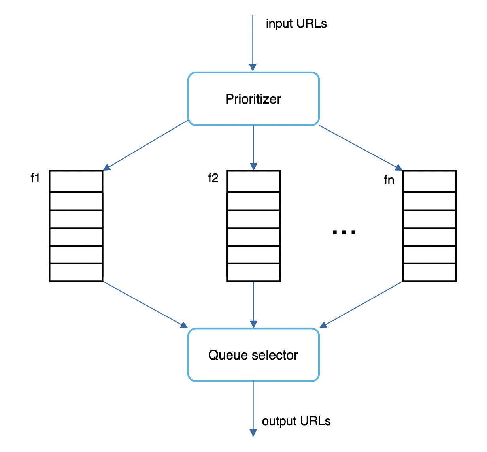
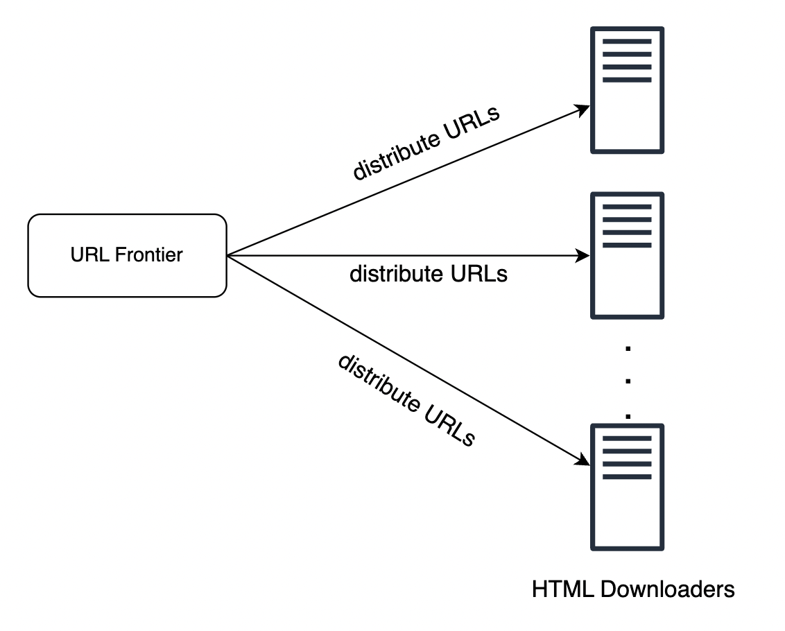

# 9. 设计网络爬虫

这是一个经典的系统设计问题：设计一个网络爬虫（Web Crawler）。

网络爬虫（又称机器人）用于在互联网上发现新内容或更新内容，例如文章、视频、PDF 等。


使用场景：

- **搜索引擎索引**：用于创建搜索引擎的本地索引，例如 Google 的 Googlebot。
- **网页归档**：从网络中收集数据并保存以备将来使用。
- **网络挖掘**：也可用于数据挖掘。例如，为交易公司寻找股东大会等重要信息。
- **网络监控**：监控网络上的版权侵权、公司内部信息泄露等。

网络爬虫的复杂性取决于目标规模，它可以非常简单（如学生项目），也可以是一个需要专门团队维护的多年项目。

## 第一步：理解问题并确定设计范围

### 高层次的工作原理

1. 给定一组 URL，下载这些 URL 指向的所有页面。
2. 从网页中提取 URL。
3. 将新提取的 URL 添加到待遍历列表中。

尽管实际的网络爬虫远比这个复杂，但核心流程可以总结为以上内容。

### 功能性需求

在设计过程中，你需要明确面试官希望支持的具体功能。例如：

- **候选人**：网络爬虫的主要用途是什么？搜索引擎索引还是数据挖掘？
  **面试官**：搜索引擎索引。
- **候选人**：每月需要抓取多少网页？
  **面试官**：10 亿个。
- **候选人**：支持哪些内容类型？HTML、PDF、图片？
  **面试官**：仅 HTML。
- **候选人**：是否需要考虑新增或修改的内容？
  **面试官**：是。
- **候选人**：是否需要持久化抓取的网页？
  **面试官**：是，保存 5 年。
- **候选人**：如何处理重复内容的页面？
  **面试官**：忽略。

通过类似的对话，你可以澄清设计范围和假设，这对于即使是简单项目也很重要。

### 非功能性需求

- **鲁棒性（Robust）**：能够处理异常情况，例如不良 HTML、无限循环、服务器崩溃等。
- **友好性（Polite）**：避免在短时间内向同一服务器发送过多请求。
- **可扩展性（Extensibility）**：便于未来添加对新内容类型的支持，例如图片。

### 粗略估算

- 每月 10 亿个页面 → 每秒约 400 页。
- 峰值 QPS = 800 页每秒。
- 平均网页大小为 500 KB → 每月 500 TB → 5 年共 30 PB。

## 第二步：提出高层设计并获得认可

网络爬虫的工作流如下：


1. **种子 URL 提供初始输入**：系统从一组初始 URL 开始（通常称为种子 URL），这些 URL 是爬虫的起点。

2. **URL 队列管理**：所有待抓取的 URL 存储在一个队列中。队列按照一定的规则（如 FIFO 或优先级）安排爬取顺序。

3. **HTML 下载器抓取内容**：从 URL 队列中获取下一个待抓取的 URL，并使用 HTML 下载器下载网页内容。

4. **DNS 解析**：在下载 HTML 页面之前，爬虫需要通过 DNS 解析将 URL 转换为服务器的 IP 地址。

5. **内容解析与验证**：下载的网页内容会通过解析器进行验证，确保其完整性和可用性。如果内容损坏或不符合要求，将丢弃。

6. **内容去重**：通过比较网页哈希值，确保网页内容和已处理的页面不重复。

7. **内容存储**：验证后的网页内容会被存储到数据库或文件系统中，供后续分析或检索使用，大部分内容存储在磁盘上，热门内容存储在内存中以便快速检索。

8. **URL 提取与过滤**：从 HTML 文档中提取所有超链接，将有效的链接加入待抓取的 URL 队列。

   - **URL 过滤器**：排除无效或不需要的链接，例如重复的 URL、不支持的内容类型、或在黑名单中的链接。

   - **URL 去重**：使用哈希表或布隆过滤器检查提取的链接是否已被访问过，以避免重复抓取。
   - **URL 存储**：已访问的 URL 会被存储到数据库中，用于 URL 去重，避免重复遍历。

## 第三步：设计深入探讨

现在让我们探讨一下网络爬虫中一些最重要的机制：

- DFS vs. BFS
- URL 队列设计
- HTML 下载器
- 鲁棒性
- 可扩展性
- 检测与规避问题内容

### DFS vs. BFS

互联网是一个有向图，网页中的链接是指向其他页面（节点）的边。

常见的两种遍历方法是深度优先搜索（DFS）和广度优先搜索（BFS）。

- DFS 通常不是一个好选择，因为遍历深度可能非常大。
- BFS 更适合，使用 FIFO 队列按遇到 URL 的顺序遍历。

不过，传统 BFS 存在两个问题：

- 大部分链接是指向同一域名的回链（例如 `wikipedia.com/page -> wikipedia.com`），短时间内大量访问同一服务器会“不礼貌”。
- 标准 BFS 没有考虑 URL 的优先级。

### URL 队列

URL 队列解决了上述问题，确保了**优先级**和**友好性**。

### 友好性

为了避免在短时间内对同一主机发送过多请求，爬虫为每个主机维护单独的下载队列，并在两次请求之间设置延迟。


- 队列路由器：确保每个队列包含来自同一主机的 URL。
- 映射表：将主机映射到相应队列。


- FIFO 队列：保存来自同一主机的 URL。
- 队列选择器：将工作线程分配给 FIFO 队列，每个线程只从一个 FIFO 队列中下载 URL。队列选择器负责分配哪个工作线程处理哪个队列。。
- 工作线程：工作线程从同一 FIFO 队列逐个下载网页，并在两次下载之间设置延迟。

### 优先级

根据页面的重要性（例如 PageRank、网页流量、更新频率）为 URL 进行优先排序。

优先级排序器（Prioritizer）管理每个 URL 的优先级：



- 将 URL 作为输入并计算优先级
- 每个队列具有不同的优先级，URL 根据其优先级放入相应的队列。
- 队列选择器随机选择队列，并偏向高优先级队列。

### 内容更新

网页不断更新，因此还需要定期重新抓取更新的内容。

可以根据网页的更新历史选择重新抓取，还可以优先重新抓取更新较多的重要页面。

### 内容存储

在实际应用中，URL 队列可能包含数百万条 URL。全部存储在内存中不可行，而存储在磁盘上速度又太慢。  
采用**混合存储**方案：大部分 URL 存储在磁盘上，当前处理的 URL 缓存在内存中，并定期刷新到磁盘。

### URL 队列存储

在现实世界中，URL 队列中的 URL 可能有数百万个，将所有内容都放在内存中是不可行的。
但将其放在磁盘上也很慢，并且可能导致抓取逻辑出现瓶颈。

可以采用混合存储的方法，其中大多数 URL 都存在磁盘上，但在内存中维护一个缓冲区，其中包含当前正在处理的 URL，定期将其刷新到磁盘。

### HTML 下载器

HTML 下载器使用 HTTP 协议从网络下载 HTML 页面。

还需要记住的一个协议是 Robots 排除协议，它是一个可在网站上使用的 `robots.txt` 文件，网站所有者使用它与网络爬虫进行通信，用于传达哪些网页可以遍历以及哪些网页应该跳过。

`robots.txt` 文件示例：

```
User-agent：Googlebot
Disallow：/creatorhub/\*
Disallow：/rss/people/\*/reviews
Disallow：/gp/pdp/rss/\*/reviews
Disallow：/gp/cdp/member-reviews/
Disallow：/gp/aw/cr/
```

需要按照该文件的规则，避免抓取其中指定跳过的页面，可以缓存该文件以避免一直重复下载。

### 性能优化

我们可以考虑对 HTML 下载器进行一些性能优化。

- **分布式抓取**：我们可以将抓取作业并行化到多台运行多个线程的机器上，以便更有效地进行抓取。



- **缓存 DNS 解析器**：我们可以维护自己的 DNS 缓存，以避免一直向 DNS 解析器发出请求，这可能会很昂贵，并定期更新缓存。
- **位置**：我们可以根据地理位置分配抓取作业。当抓取器在物理上更靠近网站服务器时，延迟会更低。
- **短超时**：我们需要添加超时，以防服务器响应速度超过给定阈值。否则，我们的抓取器可能会花费大量时间等待永远不会出现的页面。

### 鲁棒性

实现系统稳健性的一些方法：

- **一致性哈希**：为了方便扩展和缩减工作节点/爬虫等资源，我们可以在负载均衡时使用一致性哈希。
- **保存爬取状态和数据**：在服务器发生崩溃时，可以将中间结果存储到磁盘上，这样其他工作节点能够从上一次中断的地方继续任务。
- **异常处理**：我们需要优雅地处理异常，避免因错误导致服务器崩溃。在足够大的系统中，异常是不可避免的。
- **数据验证**：进行数据验证是防止系统错误的重要安全措施。

### 可扩展性

为了支持未来的新内容类型，我们需要确保爬虫具备良好的可扩展性：


示例扩展：

- 增加 **PNG 下载器** 用于爬取 PNG 图片。
- 增加 **Web 监控器** 用于监控版权侵权行为。

### 识别并避免问题内容

- **冗余内容**：互联网上约 30% 的网页是重复内容。通过哈希值/校验和避免重复处理。
- **爬虫陷阱**：一些网页可能会导致爬虫进入无限循环，例如极深的目录结构。我们可以通过设置 URL 的最大长度来避免此类问题。此外，可以引入人工干预的功能，将这些陷阱网页列入黑名单。
- **数据噪声**：过滤掉广告、代码片段、垃圾内容等无价值内容。

## 第四步 - 总结

一个优秀的爬虫的特点：可扩展性、礼貌、可扩展性、鲁棒性。

其他相关的讨论点：

- **服务器端渲染**：许多网站动态生成 HTML。如果我们在没有生成 HTML 的情况下直接解析，它将错过网站上的信息。为了解决这个问题，我们在解析页面之前先进行服务器端渲染。
- **过滤不需要的页面**：反垃圾邮件组件有助于过滤低质量页面。
- **数据库复制和分片**：这些是提高数据层可用性、可扩展性和可靠性的有效技术。
- **水平扩展**：关键是保持服务器无状态，从而使每种类型的服务器、工作线程、爬虫等都能水平扩展。
- **可用性、一致性、可靠性**：这些是任何大型系统成功的核心概念。
- **数据分析**：我们可能还需要收集和分析数据，以进一步优化我们的系统。
