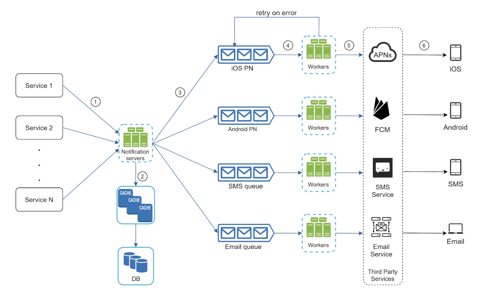
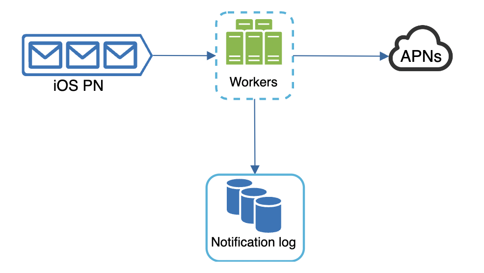
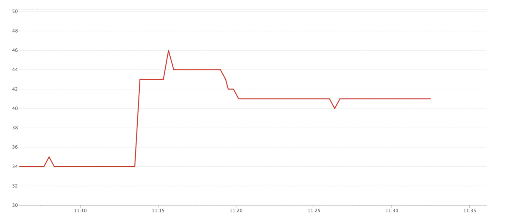

# 10. 设计通知系统

通知系统是许多应用程序的常见功能，用于向用户推送重要新闻、产品更新、事件提醒等信息。

通知有多种形式：

- 移动端推送通知
- 短信
- 邮件

## 第一步：理解问题并确定设计范围

- **候选人**：系统支持哪些类型的通知？
- **面试官**：推送通知、短信、电子邮件
- **候选人**：它是实时系统吗？
- **面试官**：软实时：尽量快速发送，但在高负载下允许一定延迟。
- **候选人**：支持哪些设备？
- **面试官**：iOS、Android、PC。
- **候选人**：通知由什么触发？
- **面试官**：通知可以由客户端应用程序触发，也可以在服务器端触发。
- **候选人**：用户是否可以选择退出？
- **面试官**：是
- **候选人**：每天有多少条通知？
- **面试官**：1000 万条移动端推送、100 万条短信、500 万封电子邮件

## 第二步：提出高层设计并获得认可

现在可以开始探讨通知系统的高层设计了。

### 各种通知类型

不同类型的通知在上层是运作的？

#### iOS 推送通知


- **提供者**：构建并发送通知请求到 Apple 推送通知服务 (APNs)。为此，它需要以下输入：

  - **设备令牌**：用于发送推送通知的唯一标识符。
  - **负载**：通知的 JSON 负载，例如：
    ```
    {
       "aps":{
          "alert":{
             "title":"游戏请求",
             "body":"Bob 想和你组队",
             "action-loc-key":"PLAY"
          },
          "badge":5
       }
    }
    ```

- **APNs** - 苹果提供的服务，用于发送移动推送通知。
- **iOS 设备** - 接收推送通知的客户端。

#### Android 推送通知

采用类似方法，但使用 Firebase Cloud Messaging (FCM) 作为 APNs 的替代方案。


#### 短信

利用第三方提供商如 Twilio 发送。


#### 邮件

虽然客户可以设置自己的邮件服务器，但大多数客户选择使用第三方服务，例如 Mailchimp:


这是包含所有通知提供商后的最终设计:


### 联系信息收集

为了发送通知，需要先收集一些来自用户的输入。这通常在用户注册时完成：


存储联系信息的数据库表格示例：


### 通知发送/接收流程

这是通知系统的高层设计：


- **服务 1 到 N** - 系统中的其他服务或定时任务触发通知发送事件。
- **通知系统** - 接收通知发送消息，并将其传播到正确的提供者。
- **第三方服务** - 负责通过适当的媒介将消息发送给正确的用户。此部分应该具备可扩展性，以便在将来更换第三方服务提供商时进行调整。
- **iOS、Android、SMS、Email** - 用户在其设备上接收通知。

此设计中的一些问题：

- **单点故障** - 只有单一的通知服务。
- **难以扩展** - 由于通知系统处理所有事务，独立扩展缓存、数据库、服务层等比较困难。
- **性能瓶颈** - 将所有任务集中处理可能会成为瓶颈，特别是对于像构建 HTML 页面这种资源密集型的任务。

### 高层设计（改进版）

相较于原始的简单设计，为解决单点故障、性能瓶颈等问题，进行了以下改进：

- 将数据库和缓存移出通知服务
- 添加更多通知服务器并设置自动扩展与负载均衡
- 引入消息队列以解耦系统组件



- **服务 1 到 N** - 系统中发送通知的其他服务。
- **通知服务器** - 提供发送通知的 API，面向内部服务或已验证的客户端，进行基本验证，获取通知模板并从数据库中取出，讲通知数据放入消息队列进行并行处理。
- **缓存** - 存储用户信息、设备信息、通知模板等。
- **数据库** - 存储有关用户、通知、设置等数据。
- **消息队列** - 消除组件之间的依赖，作为缓冲区以等待通知发送。每个通知提供商都有一个独立的消息队列，避免单个第三方提供商的故障影响其他提供商。
- **工作进程** - 从消息队列中拉取通知事件，并将其发送到相应的第三方服务。
- **第三方服务** - 已在初始设计中涵盖。
- **iOS、Android、SMS、Email** - 已在初始设计中涵盖。

发送电子邮件的 API 调用示例：

```
{
   "to":[
      {
         "user_id":123456
      }
   ],
   "from":{
      "email":"from_address@example.com"
   },
   "subject":"Hello World!",
   "content":[
      {
         "type":"text/plain",
         "value":"Hello, World!"
      }
   ]
}
```

通知的生命周期示例：

- 服务发起通知请求
- 通知服务从数据库/缓存中获取元数据（用户信息、设置等）
- 通知事件被发送到相应的队列中，供每个第三方提供商处理。
- 工作进程从消息队列中提取通知并发送给第三方服务。
- 第三方服务将通知传递给最终用户。

## 第三步：设计深入分析

在这一部分，我们将讨论改进设计中的一些附加考虑因素。

### 可靠性

为了保证系统的可靠性，需要考虑以下问题：

- 数据丢失时会发生什么？
- 收件人是否会收到通知且每次仅收到一次？

为了避免数据丢失，我们可以将通知存储在工作进程的通知日志数据库中，并在通知未发送成功时进行重试：



那么，如何处理重复通知？

由于无法保证通知的“精确一次”投递（除非第三方 API 提供幂等性键），偶尔会发生重复通知。如果第三方 API 不提供幂等性，仍可以通过在端实现去重机制来降低重复通知的概率，若通知事件 ID 已出现，则丢弃该事件。

### 通知模板

为了避免客户端每次都重新构建通知，我们将引入通知模板，因为许多通知可以复用相同的模板：

```
TITLE:
您的订单已签收

BODY:
您购买的[ITEM NAME]已经被签收，运单编号[ITEM TRACKING NUMBER]
```

### 通知设置

在发送任何通知之前，我们首先通过以下数据库表检查用户是否已选择接收指定通信渠道的通知：

```
user_id bigInt
channel varchar # 推送通知、电子邮件或短信
opt_in boolean # 用户是否选择接收通知
```

### 限流

为了避免过多通知让用户不堪重负，我们可以在客户端引入一些限流措施（由我们端实现），这样用户不会因为收到大量通知而立即选择取消订阅。

### 重试机制

如果第三方提供者无法发送通知，通知将被放入重试队列。如果问题持续存在，则通知开发人员。

### 推送通知的安全性

只有经过验证和认证的客户端才能通过我们的 API 发送推送通知。通过要求使用 `appKey` 和 `appSecret` 来实现这一点，灵感来源于 `Android/Apple` 的通知服务器。

### 监控队列中的通知

一个关键的监控指标是队列中通知的数量。如果队列过大，我们可能需要增加更多的工作进程：



### 事件追踪

我们可能需要追踪与通知相关的某些事件，例如打开率、点击率等。

通常，通过集成分析服务来完成这一点，因此我们需要将通知系统与某个分析服务进行集成。


### 更新后的设计

将所有内容汇总在一起，这是我们的最终设计：


新增的其他功能：

- 通知服务器配备了身份验证和限流功能。
- 增加了重试机制来处理通知失败。
- 增加了通知模板，以提供一致的通知体验。
- 增加了监控和追踪系统，以便跟踪系统健康状况，并为未来的改进提供支持。

## 第四步：总结

我们构建了一个支持多渠道的通知系统，采用了消息队列实现解耦，增强了系统的可扩展性与可靠性。

我们还深入研究了一些组件和优化：

- **可靠性**：添加了重试机制处理失败。
- **安全性**：通过 `AppKey` 和 `AppSecret` 确保仅认证客户端可发送通知。
- **用户友好**：支持退订与限流，用户可以选择不接收通知，服务在发送通知之前会先检查用户设置。
- **监控和优化**：加入分析与监控，跟踪系统健康状态。
