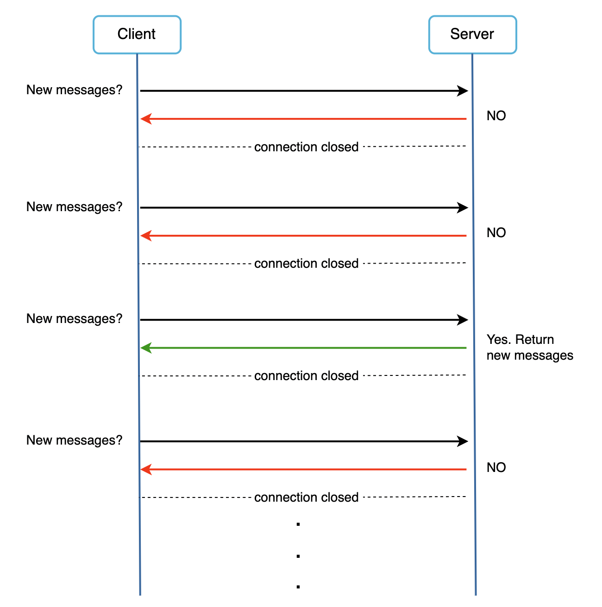
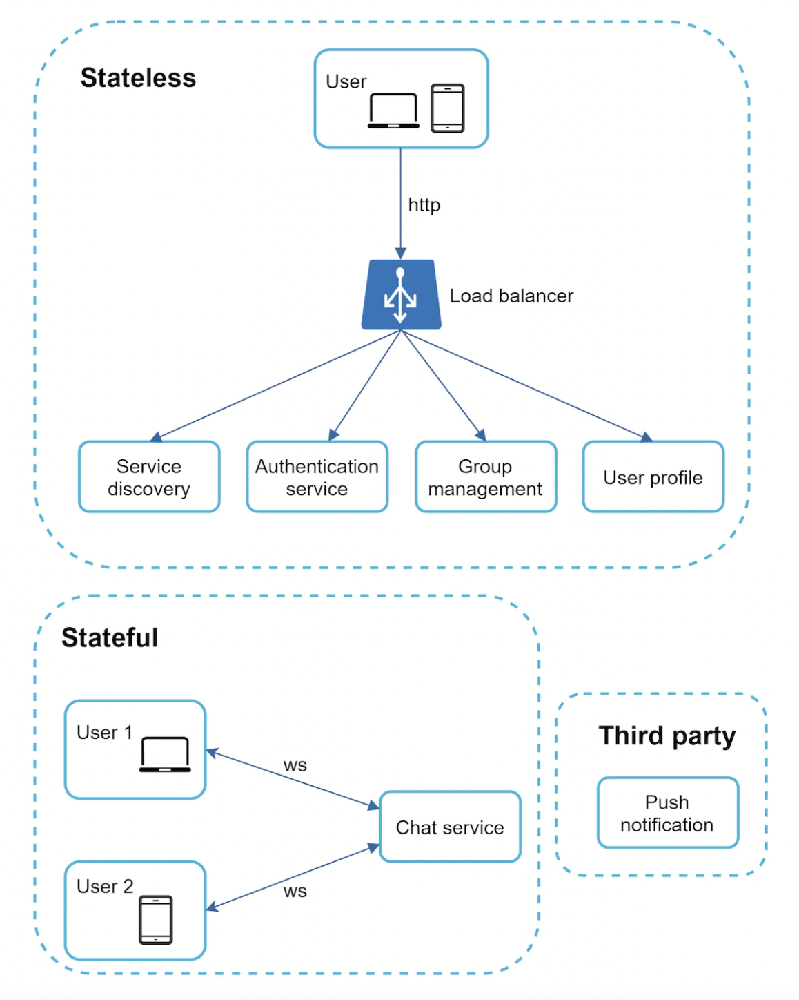
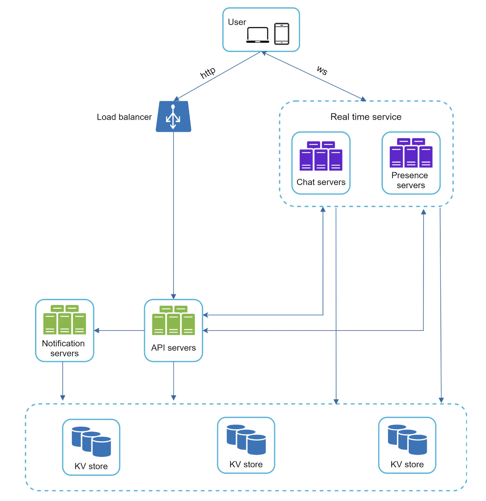
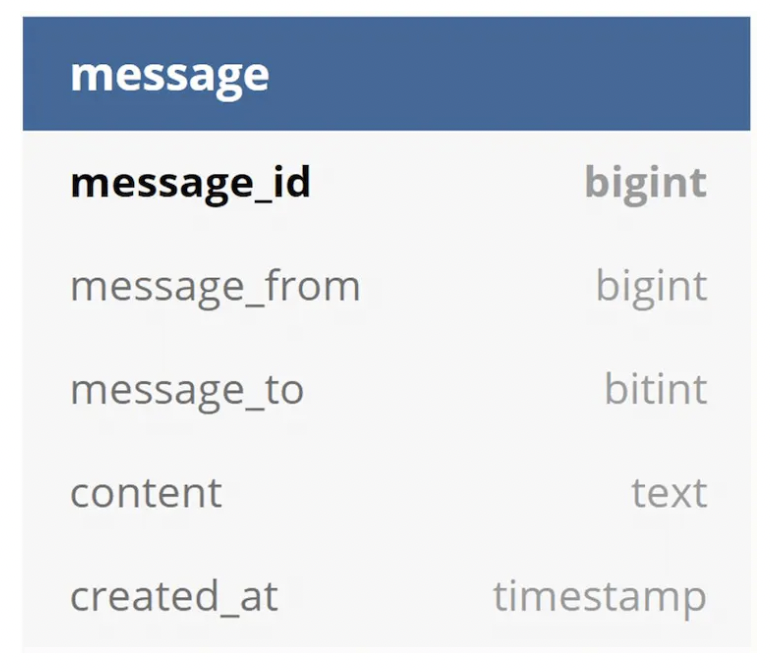
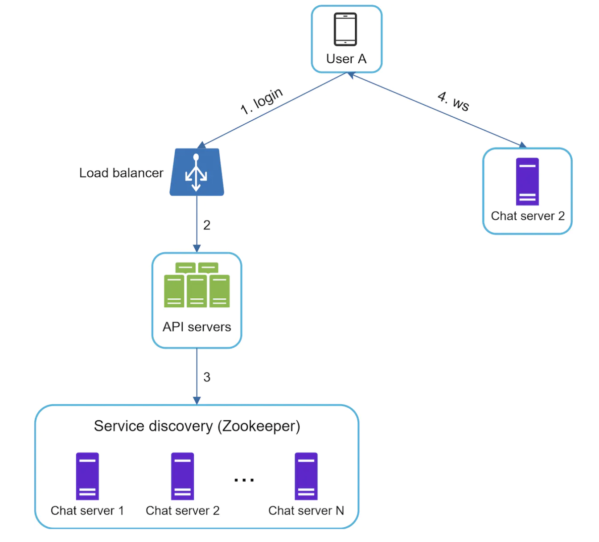
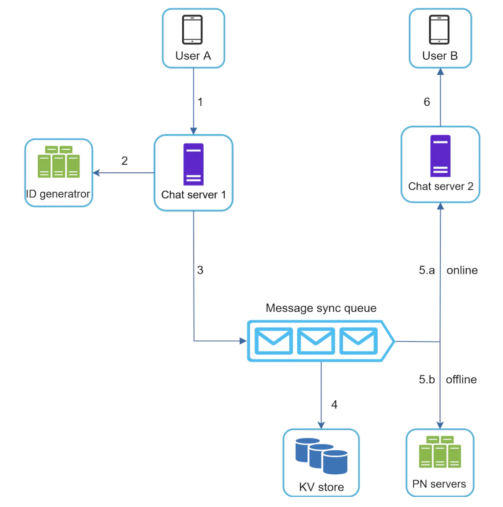
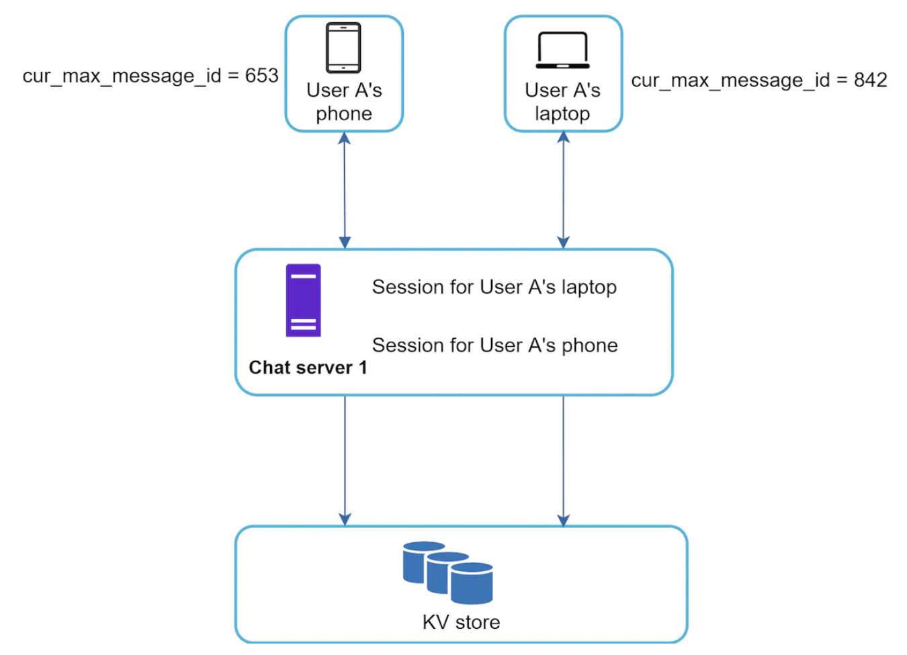
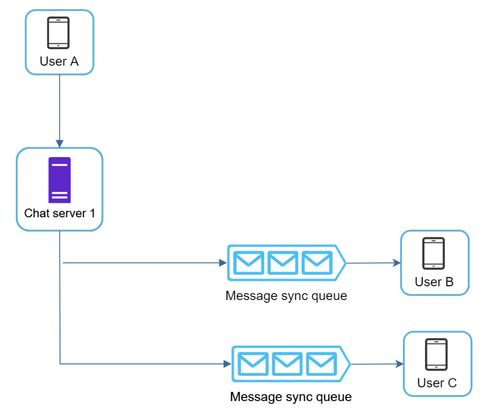
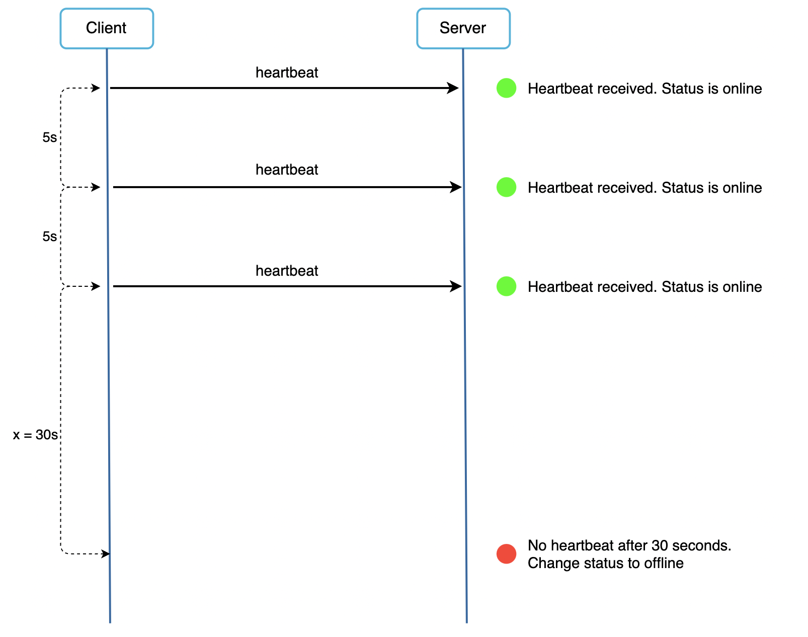

# 12. 设计聊天系统

我们将设计一个类似于微信、WhatsApp 的聊天系统。

在这种情况下，明确具体需求非常重要，因为聊天系统可能会有很大差异，例如，专注于群聊的系统与专注于一对一聊天的系统。

## 第一步：理解问题并明确设计范围

- **候选人**：我们应该设计什么样的聊天应用？是专注于一对一聊天还是群聊？
- **面试官**：需要支持这两种情况。
- **候选人**：移动端应用、Web 应用，还是两者都支持？
- **面试官**：两者都要支持。
- **候选人**：系统的规模如何？是初创应用还是大规模应用？
- **面试官**：应支持 5000 万日活跃用户（DAU）。
- **候选人**：群聊的成员人数限制是多少？
- **面试官**：100 人。
- **候选人**：需要哪些关键功能？例如附件支持？
- **面试官**：一对一和群聊，在线状态指示，仅支持文本消息。
- **候选人**：消息长度是否有限制？
- **面试官**：文本长度小于 10 万字符。
- **候选人**：是否需要端到端加密？
- **面试官**：不需要，但有时间可以讨论。
- **候选人**：聊天历史需要保存多长时间？
- **面试官**：永久保存。

**功能性需求总结如下：**

- 一对一聊天，低延迟消息传递。
- 小规模群聊（100 人）。
- 在线状态指示。
- 同一账户可在多设备登录。
- 推送通知。
- 支持 5000 万日活跃用户的规模。

## 第二步：提出高层设计并获得认可

首先了解客户端和服务器之间如何通信。

- 在此系统中，客户端可以是移动设备或 Web 浏览器。
- 它们不直接连接到彼此，而是连接到服务器。

**聊天服务需要支持的主要功能：**

- 接收来自客户端的消息。
- 找到消息的正确接收者并进行转发。
- 如果接收者不在线，保存消息，直到其重新上线。

当客户端连接到服务器时，可以使用一种或多种网络协议。

一种选择是 HTTP，这适合发送方，但对接收方而言并不理想。

服务器发起的消息有多种处理方式，例如轮询、长轮询和 WebSocket。

#### 轮询（Polling）

轮询要求客户端定期向服务器请求状态更新：

这种方式易于实现，但代价高昂，因为存在大量请求且常常无结果。

#### 长轮询（Long Polling）

使用长轮询时，客户端在等待服务器端事件发生时保持连接打开。

尽管用户聊天频率较低时仍会产生一些无效请求，但比普通轮询更高效。

其他注意点：

- 服务器难以判断客户端是否断开连接。
- 发送方和接收方可能连接到不同服务器。

#### WebSocket

这是双向通信时最常用的方法：

连接由客户端发起，最初为 HTTP，但握手后可以升级。

在这种设置下，客户端和服务器均可发起消息。

**WebSocket 的一个注意点**：这是一种持久化协议，使得服务器具有状态化。需要高效的连接管理。

---

### 高层设计

虽然 WebSocket 可用于消息交换，但大多数其他标准功能可以通过基于 HTTP 的传统请求/响应协议实现。

基于此，我们可以将服务划分为三部分：**无状态 API**、**有状态 WebSocket API** 和 **第三方推送通知集成**：

#### 无状态服务

传统的面向用户的请求/响应服务，用于管理登录、注册、用户资料等。

这些服务位于负载均衡器后方，负责将请求分配到多个服务副本。

服务发现模块（Service Discovery）尤为重要，稍后将在详细分析中展开讨论。

#### 有状态服务

唯一的有状态服务是聊天服务，因为它维护与客户端的持久连接。

当客户端连接到某个聊天服务后，在该服务保持存活的情况下不会切换到其他服务。

服务发现与聊天服务紧密协作以避免过载。

#### 第三方集成

聊天应用需要支持推送通知，以便在收到消息时通知用户。

这一部分将不会深入讨论，因为它已在[10. 设计通知系统](./30_design_a_notification_system.md)中详述。

---

### 可扩展性

在小规模情况下，我们可以将所有内容都部署在单个服务器上。

假设有 100 万并发用户，每个连接占用 10KB 内存，那么单个服务器需要使用 10GB 内存来服务所有用户。

尽管如此，我们不应直接提出单服务器设计，因为这会在面试官心中埋下红旗。

**单服务器设计的一个主要缺点是单点故障。**

在面试中，可以从单服务器设计开始，并明确表示后续可以扩展。

以下是我们优化后的高层设计：

- 客户端通过 WebSocket 与聊天服务器保持持久连接，以实现实时消息传递。
- 聊天服务器负责消息的发送和接收。
- 在线状态服务器管理用户的在线/离线状态。
- API 服务器处理基于请求/响应的任务，如登录、注册、修改资料等。
- 通知服务器负责推送通知。
- 键值存储用于存储聊天历史。当离线用户重新上线时，可以看到聊天历史和未读消息。

---

### 存储

存储层的一个重要决策是选择 SQL 数据库还是 NoSQL 数据库。

**决策依据：**

需要仔细分析读写访问模式。

- 用户资料、设置、好友列表等传统数据可以存储在关系型数据库中。
- 聊天历史则是非常特殊的数据，因为其读写模式具有独特特点：
  - 数据量巨大。[一项研究](https://www.theverge.com/2016/4/12/11415198/facebook-messenger-whatsapp-number-messages-vs-sms-f8-2016)显示，Facebook 和 WhatsApp 每天处理 600 亿条消息。
  - 只有最近的聊天会被频繁访问，用户通常不会回看太久以前的聊天记录。
  - 即使聊天历史访问频率较低，仍需要支持全文搜索以满足用户通过搜索栏随机访问的需求。
  - 聊天应用的读写比通常为 1:1。

选择合适的存储系统对这种数据至关重要，**推荐使用键值存储（Key-Value Store）：**

- 易于横向扩展。
- 提供低延迟的数据访问。
- 关系型数据库无法很好地处理“长尾”（访问频率低但占比大的数据分布）。索引变大后，随机访问成本昂贵。
- 键值存储被广泛应用于聊天系统，Facebook 使用 HBase，Discord 使用 Cassandra。

---

### 数据模型

接下来我们看看消息的数据模型。

#### 一对一聊天的消息表

**注意：** 我们将使用主键 `message_id` 而不是 `created_at` 来确定消息顺序，因为消息可能在同一时间发送。

#### 群聊的消息表

在上述表中，`(channel_id, message_id)` 是主键，而 `channel_id` 也是分片键。

**一个有趣的问题：`message_id` 应如何生成？**

它应具备两个重要属性：

- ID 必须唯一。
- ID 必须按时间可排序。

一种选择是使用关系数据库的 `auto_increment` 功能，但键值存储不支持此功能。

另一种方法是使用 Snowflake 算法（Twitter 开发的生成 64 位唯一 ID 的算法），用于生成全局唯一且可按时间排序的 64 字节 ID。

最后，我们还可以使用局部序列号生成器，仅在群聊范围内唯一即可。这种方案适用于只需保证单个聊天内部消息顺序，而不需要保证不同聊天之间的消息顺序的情况。

以下是文章的翻译，包含所有段落和图片描述：

---

## 第三步：深入设计

在系统设计面试中，通常需要对某些组件进行深入探讨。

在本案例中，我们将深入探讨 **服务发现组件**、**消息传递流程** 和 **在线/离线状态指示**。

### 服务发现

服务发现的主要目标是根据一些标准（例如地理位置、服务器容量等）选择最佳服务器。

Apache Zookeeper 是一种流行的开源服务发现解决方案。它会注册所有可用的聊天服务器，并根据预定义的标准选择最佳服务器。

- 用户 A 尝试登录应用程序。
- 负载均衡器将请求发送到 API 服务器。
- 经过身份验证后，服务发现为用户 A 选择最佳的聊天服务器。在本例中，选择了聊天服务器 2。
- 用户 A 通过 WebSocket 协议连接到聊天服务器 2。

---

### 消息传递流程

消息传递流程是一个有趣的话题，我们将深入探讨 **一对一聊天**、**消息同步** 和 **群聊**。

#### 一对一聊天流程

- 用户 A 向聊天服务器 1 发送消息。
- 聊天服务器 1 从 ID 生成器获取一个 `message_id`。
- 聊天服务器 1 将消息发送到 "消息同步队列"。
- 消息存储在键值存储中。
- 如果用户 B 在线，消息会被转发到用户 B 所连接的聊天服务器 2。
- 如果用户 B 离线，推送通知会通过推送通知服务器发送。
- 聊天服务器 2 将消息转发给用户 B。

---

#### 跨设备的消息同步

- 当用户 A 通过手机登录时，设备与聊天服务器 1 建立一个 WebSocket 连接。
- 每个设备维护一个名为 `cur_max_message_id` 的变量，用于跟踪该设备接收到的最新消息。
- 当前登录的设备会将 **消息接收者 ID** 和 **`message_id` 大于 `cur_max_message_id`** 的消息视为新消息。

---

#### 小型群聊流程

群聊的消息传递比一对一聊天稍微复杂一些：

当用户 A 发送消息时，消息会被复制到群组中每个成员（用户 B 和用户 C）的消息队列中。

对于小型群聊，每个用户一个独立的消息队列是一个不错的选择，因为：

- 它简化了消息同步，每个用户只需查阅自己的队列即可。
- 为每个参与者的收件箱存储一份消息副本对于小型群聊是可行的。

然而，对于大型群聊，这种方法不可接受。

对于收件人而言，他们的队列中可能包含来自不同群聊的消息：

---

### 在线状态指示

在线状态服务器管理聊天应用中的在线/离线指示功能。

当用户登录时，他们的状态会被设置为“在线”：

当用户向在线状态服务器发送注销消息（随后断开连接）时，他们的状态会被设置为“离线”：

一个需要注意的问题是如何处理用户断开连接的情况。一个简单的方法是当用户与在线状态服务器断开连接时将其标记为“离线”。  
然而，这可能导致糟糕的用户体验，因为由于网络不佳，用户可能频繁断开和重新连接。

为了解决这个问题，我们引入了一种心跳机制——客户端定期向在线状态服务器发送心跳，以表示其在线状态。如果在指定时间内未收到心跳，用户会被标记为离线：

那么用户的好友如何得知其在线状态呢？

我们将使用一种广播机制（fanout），每对好友都会分配一个队列，状态变化会发送到相应的队列：

这种方法在小型群聊中非常有效。微信就采用了类似的方法，其用户群组上限为 500 人。

如果需要支持更大的群组，一种可能的解决方案是仅在用户进入群组或刷新成员列表时获取在线状态。

## 第四步：总结

我们构建了一个支持一对一聊天和群聊的聊天系统，使用 WebSocket 实现客户端与服务器之间的实时通信。

### 系统组件

- 聊天服务器（处理实时消息）
- 在线状态服务器（管理在线/离线状态）
- 推送通知服务器
- 用于存储聊天记录的键值存储
- 处理其他任务的 API 服务器

### 补充讨论点

- **扩展支持媒体功能**：包括视频、图片和语音。可以讨论压缩、云存储和缩略图生成。
- **端到端加密**：只有发送方和接收方能读取消息。
- **客户端缓存消息**：减少服务器和客户端之间的数据传输。
- **提升加载速度**：例如，Slack 构建了一个地理分布式网络，用于缓存用户数据和频道信息，以提高加载速度。
- **错误处理**：如果聊天服务器宕机会发生什么？可以通过 Zookeeper 处理交接到另一台服务器。
- **消息重发机制**：常见的重发方法包括重试和排队。
