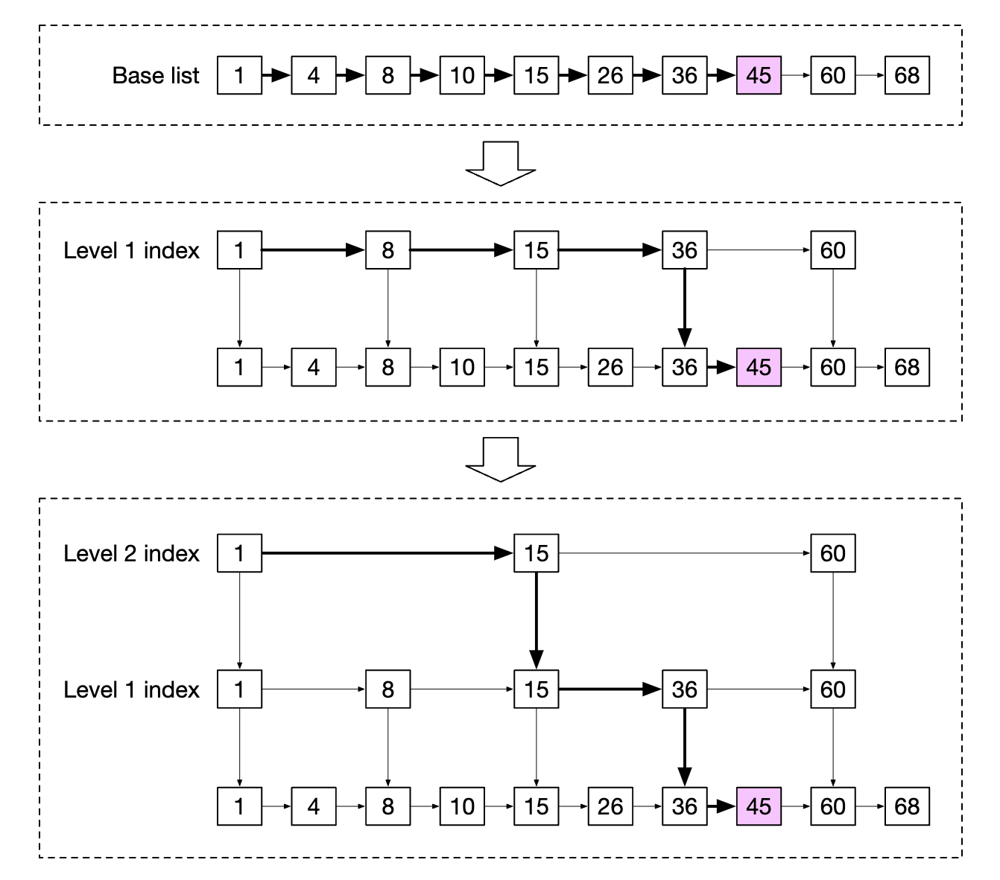
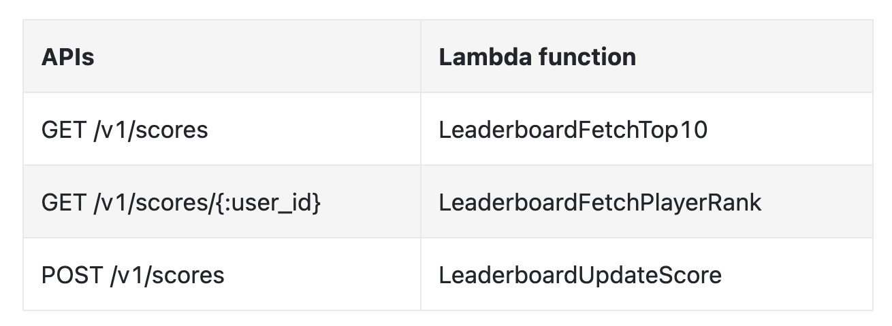
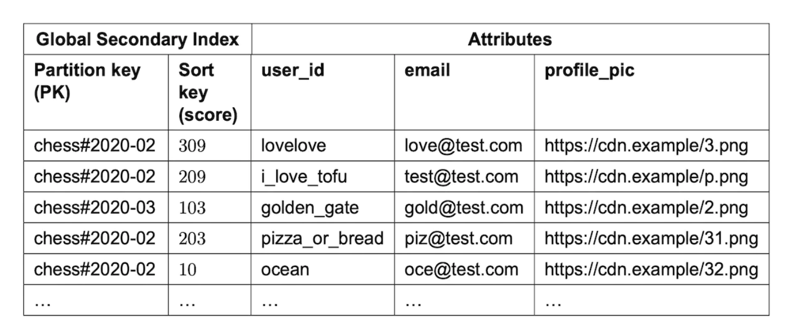
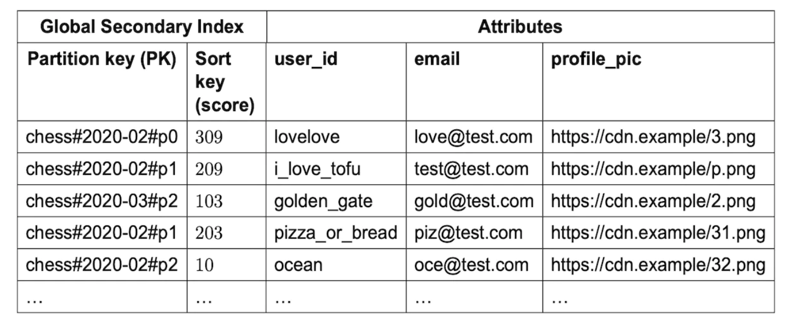
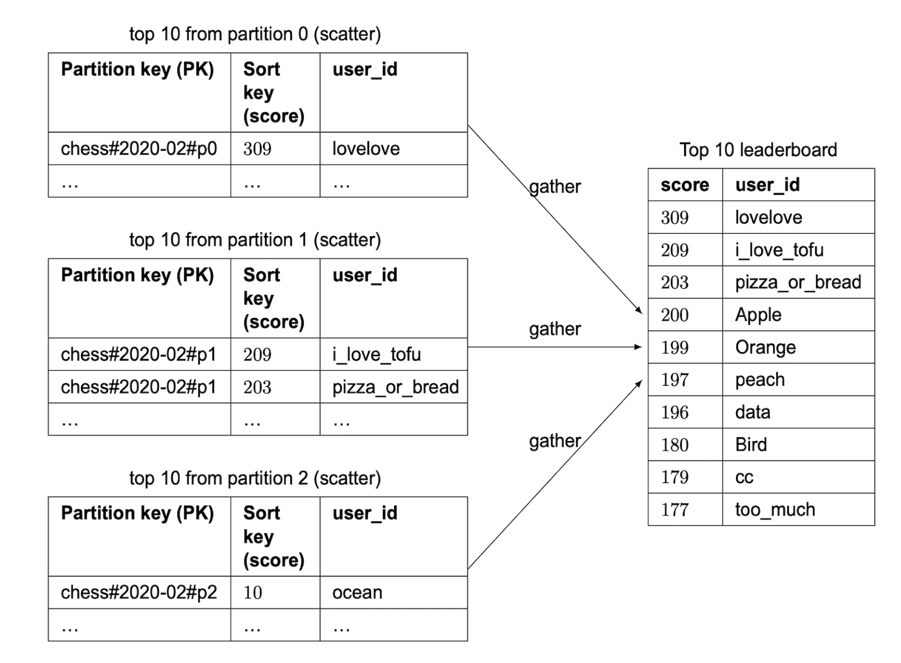

# Real-time Gaming Leaderboard

We are going to design a leaderboard for an online mobile game:


## Step 1 - Understand the Problem and Establish Design Scope

- C: How is the score calculated for the leaderboard?
- I: User gets a point whenever they win a match.
- C: Are all players included in the leaderboard?
- I: Yes
- C: Is there a time segment, associated with the leaderboard?
- I: Each month, a new tournament starts which starts a new leaderboard.
- C: Can we assume we only care about top 10 users?
- I: We want to display top 10 users, along with position of specific user. If time permits, we can discuss showing users around particular user in the leaderboard.
- C: How many users are in a tournament?
- I: 5mil DAU and 25mil MAU
- C: How many matches are played on average during a tournament?
- I: Each player plays 10 matches per day on average
- C: How do we determine the rank if two players have the same score?
- I: Their rank is the same in that case. If time permits, we can discuss breaking ties.
- C: Does the leaderboard need to be real-time?
- I: Yes, we want to present real-time results or as close as possible to real-time. It is not okay to present batched result history.

### Functional requirements

- Display top 10 players on leaderboard
- Show a user's specific rank
- Display users which are four places above and below given user (bonus)

### Non-functional requirements

- Real-time updates on scores
- Score update is reflected on the leaderboard in real-time
- General scalability, availability, reliability

### Back-of-the-envelope estimation

With 50mil DAU, if the game has an even distribution of players during a 24h period, we'd have an average of 50 users per second.
However, since distribution is typically uneven, we can estimate that the peak online users would be 250 users per second.

QPS for users scoring a point - given 10 games per day on average, 50 users/s \* 10 = 500 QPS. Peak QPS = 2500.

QPS for fetching the top 10 leaderboard - assuming users open that once a day on average, QPS is 50.

## Step 2 - Propose High-Level Design and Get Buy-In

### API Design

The first API we need is one to update a user's score:

```
POST /v1/scores
```

This API takes two params -`user_id`and`points`scored for winning a game.

This API should only be accessible to game servers, not end clients.

Next one is for getting the top 10 players of the leaderboard:

```
GET /v1/scores
```

Example response:

```
{
  "data": [
    {
      "user_id": "user_id1",
      "user_name": "alice",
      "rank": 1,
      "score": 12543
    },
    {
      "user_id": "user_id2",
      "user_name": "bob",
      "rank": 2,
      "score": 11500
    }
  ],
  ...
  "total": 10
}
```

You can also get the score of a particular user:

```
GET /v1/scores/{:user_id}
```

Example response:

```
{
    "user_info": {
        "user_id": "user5",
        "score": 1000,
        "rank": 6,
    }
}
```

### High-level architecture


- When a player wins a game, client sends a request to the game service
- Game service validates if win is valid and calls the leaderboard service to update the player's score
- Leaderboard service updates the user's score in the leaderboard store
- Player makes a call to leaderboard service to fetch leaderboard data, eg top 10 players and given player's rank

An alternative design which was considered is the client updating their score directly within the leaderboard service:


This option is not secure as it's susceptible to man-in-the-middle attacks. Players can put a proxy and change their score as they please.

One additional caveat is that for games, where the game logic is managed by the server, cliets don't need to call the server explicitly to record their win.
Servers do it automatically for them based on the game logic.

One additional consideration is whether we should put a message queue between the game server and the leaderboard service. This would be useful if other services are interested in game results, but that is not an explicit requirement in the interview so far, hence it's not included in the design:


### Data models

Let's discuss the options we have for storing leaderboard data - relational DBs, Redis, NoSQL.

The NoSQL solution is discussed in the deep dive section.

### Relational database solution

If the scale doesn't matter and we don't have that many users, a relational DB serves our quite well.

We can start from a simple leaderboard table, one for each month (personal note - this doesn't make sense. You can just add a`month`column and avoid the headache of maintaining new tables each month):


There is additional data to include in there, but that is irrelevant to the queries we'd run, so it's omitted.

What happens when a user wins a point?


If a user doesn't exist in the table yet, we need to insert them first:

```
INSERT INTO leaderboard (user_id, score) VALUES ('mary1934', 1);
```

On subsequent calls, we'd just update their score:

```
UPDATE leaderboard set score=score + 1 where user_id='mary1934';
```

How do we find the top players of a leaderboard?


We can run the following query:

```
SELECT (@rownum := @rownum + 1) AS rank, user_id, score
FROM leaderboard
ORDER BY score DESC;
```

This is not performant though as it makes a table scan to order all records in the database table.

We can optimize it by adding an index on`score`and using the`LIMIT`operation to avoid scanning everything:

```
SELECT (@rownum := @rownum + 1) AS rank, user_id, score
FROM leaderboard
ORDER BY score DESC
LIMIT 10;
```

This approach, however, doesn't scale well if the user is not at the top of the leaderboard and you'd want to locate their rank.

### Redis solution

We want to find a solution, which works well even for millions of players without having to fallback on complex database queries.

Redis is an in-memory data store, which is fast as it works in-memory and has a suitable data structure to serve our needs - sorted set.

A sorted set is a data structure similar to sets in programming languages, which allows you to keep a data structure sorted by a given criteria.
Internally, it is implemented using a hash-map to maintain mapping between key (user_id) and value (score) and a skip list which maps scores to users in sorted order:


How does a skip list work?

- It is a linked list which allows for fast search
- It consists of a sorted linked list and multi-level indexes



This structure enables us to quickly search for specific values when the data set is large enough.
In the example below (64 nodes), it requires traversing 62 nodes in a base linked list to find the given value and 11 nodes in the skip-list case:


Sorted sets are more performant than relational databases as the data is kept sorted at all times at the price of O(logN) add and find operation.

In contract, here's an example nested query we need to run to find the rank of a given user in a relational DB:

```
SELECT *,(SELECT COUNT(*) FROM leaderboard lb2
WHERE lb2.score >= lb1.score) RANK
FROM leaderboard lb1
WHERE lb1.user_id = {:user_id};
```

What operations do we need to operate our leaderboard in Redis?

- `ZADD`- insert the user into the set if they don't exist. Otherwise, update the score. O(logN) time complexity.
- `ZINCRBY`- increment the score of a user by given amount. If user doesn't exist, score starts at zero. O(logN) time complexity.
- `ZRANGE/ZREVRANGE`- fetch a range of users, sorted by their score. We can specify order (ASC/DESC), offset and result size. O(logN+M) time complexity where M is result size.
- `ZRANK/ZREVRANK`- Fetch the position (rank) of given user in ASC/DESC order. O(logN) time complexity.

What happens when a user scores a point?

```
ZINCRBY leaderboard_feb_2021 1 'mary1934'
```

There's a new leaderboard created every month while old ones are moved to historical storage.

What happens when a user fetches top 10 players?

```
ZREVRANGE leaderboard_feb_2021 0 9 WITHSCORES
```

Example result:

```
[(user2,score2),(user1,score1),(user5,score5)...]
```

What about user fetching their leaderboard position?


This can be easily achieved by the following query, given that we know a user's leaderboard position:

```
ZREVRANGE leaderboard_feb_2021 357 365
```

A user's position can be fetched using`ZREVRANK <user-id>`.

Let's explore what our storage requirements are:

- Assuming worst-case scenario of all 25mil MAU participating in the game for a given month
- ID is 24-character string and score is 16-bit integer, we need 26 bytes \* 25mil = ~650MB of storage
- Even if we double the storage cost due to the overhead of the skip list, this would still easily fit in a modern redis cluster

Another non-functional requirement to consider is supporting 2500 updates per second. This is well within a single Redis server's capabilities.

Additional caveats:

- We can spin up a Redis replica to avoid losing data when a redis server crashes
- We can still leverage Redis persistence to not lose data in the event of a crash
- We'll need two supporting tables in MySQL to fetch user details such as username, display name, etc as well as store when eg a user won a game
- The second table in MySQL can be used to reconstruct leaderboard when there is an infrastructure failure
- As a small performance optimization, we could cache the user details of top 10 players as they'd be frequently accessed

## Step 3 - Design Deep Dive

### To use a cloud provider or not

We can either choose to deploy and manage our own services or use a cloud provider to manage them for us.

If we choose to manage the services our selves, we'll use redis for leaderboard data, mysql for user profile and potentially a cache for user profile if we want to scale the database:


Alternatively, we could use cloud offerings to manage a lot of the services for us. For example, we can use AWS API Gateway to route API calls to AWS Lambda functions:



AWS Lambda enables us to run code without managing or provisioning servers ourselves. It runs only when needed and scales automatically.

Exmaple user scoring a point:


Example user retrieving leaderboard:


Lambdas are an implementation of a serverless architecture. We don't need to manage scaling and environment setup.

Author recommends going with this approach if we build the game from the ground up.

### Scaling Redis

With 5mil DAU, we can get away with a single Redis instance from both a storage and QPS perspective.

However, if we imagine userbase grows 10x to 500mil DAU, then we'd need 65gb for storage and QPS goes to 250k.

Such scale would require sharding.

One way to achieve it is by range-partitioning the data:


In this example, we'll shard based on user's score. We'll maintain the mapping between user_id and shard in application code.
We can do that either via MySQL or another cache for the mapping itself.

To fetch the top 10 players, we'd query the shard with the highest scores (`[900-1000]`).

To fetch a user's rank, we'll need to calculate the rank within the user's shard and add up all users with higher scores in other shards.
The latter is a O(1) operation as total records per shard can quickly be accessed via the info keyspace command.

Alternatively, we can use hash partitioning via Redis Cluster. It is a proxy which distributes data across redis nodes based on partitioning similar to consistent hashing, but not exactly the same:


Calculating the top 10 players is challenging with this setup. We'll need to get the top 10 players of each shard and merge the results in the application:


There are some limitations with the hash partitioning:

- If we need to fetch top K users, where K is high, latency can increase as we'll need to fetch a lot of data from all the shards
- Latency increases as the number of partitions grows
- There is no straightforward approach to determine a user's rank

Due to all this, the author leans towards using fixed partitions for this problem.

Other caveats:

- A best practice is to allocate twice as much memory as required for write-heavy redis nodes to accommodate snapshots if required
- We can use a tool called Redis-benchmark to track the performance of a redis setup and make data-driven decisions

### Alternative solution: NoSQL

An alternative solution to consider is using an appropriate NoSQL database optimized for:

- heavy writes
- effectively sorting items within the same partition by score

DynamoDB, Cassandra or MongoDB are all good fits.

In this chapter, the author has decided to use DynamoDB. It is a fully-managed NoSQL database, which offers reliable performance and great scalability.
It also enables usage of global secondary indexes when we need to query fields not part of the primary key.


Let's start from a table for storing a leaderboard for a chess game:


This works well, but doesn't scale well if we need to query anything by score. Hence, we can put the score as a sort key:



Another problem with this design is that we're partitioning by month. This leads to a hotspot partition as the latest month will be unevenly accessed compared to the others.

We could use a technique called write sharding, where we append a partition number for each key, calculated via`user_id % num_partitions`:



An important trade-off to consider is how many partitions we should use:

- The more partitions there are, the higher the write scalability
- However, read scalability suffers as we need to query more partitions to collect aggregate results

Using this approach requires that we use the "scatter-gather" technique we saw earlier, which grows in time complexity as we add more partitions:



To make a good evaluation on the number of partitions, we'd need to do some benchmarking.

This NoSQL approach still has one major downside - it is hard to calculate the specific rank of a user.

If we have sufficient scale to require us to shard, we could then perhaps tell users what "percentile" of scores they're in.

A cron job can periodically run to analyze score distributions, based on which a user's percentile is determined, eg:

```
10th percentile = score < 100
20th percentile = score < 500
...
90th percentile = score < 6500
```

## Step 4 - Wrap Up

Other things to discuss if time permits:

- Faster retrieval - We can cache the user object via a Redis hash with mapping`user_id -> user object`. This enables faster retrieval vs. querying the database.
- Breaking ties - When two players have the same score, we can break the tie by sorting them based on last played game.
- System failure recovery - In the event of a large-scale Redis outage, we can recreate the leaderboard by going through the MySQL WAL entries and recreate it via an ad-hoc script
